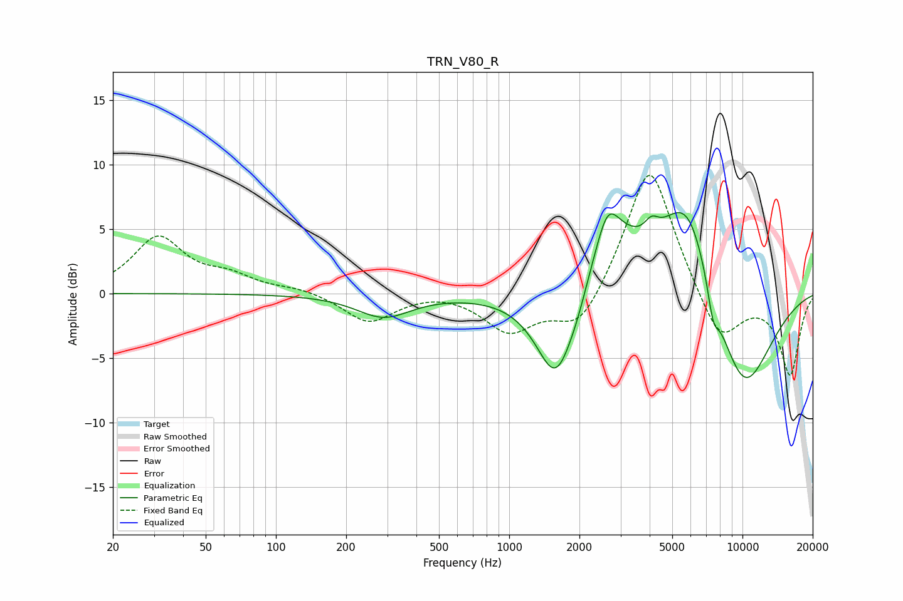

# TRN_V80_R
See [usage instructions](https://github.com/jaakkopasanen/AutoEq#usage) for more options and info.

### Parametric EQs
Apply preamp of -6.4 dB when using parametric equalizer.

|   # | Type    |   Fc (Hz) |    Q |   Gain (dB) |
|-----|---------|-----------|------|-------------|
|   1 | Peaking |       290 | 1.21 |        -1.8 |
|   2 | Peaking |      1594 | 1.63 |        -7.6 |
|   3 | Peaking |      1972 | 3.14 |        -0.8 |
|   4 | Peaking |      2637 | 3.31 |         2.1 |
|   5 | Peaking |      2669 | 1.28 |         4.9 |
|   6 | Peaking |      4071 | 4.66 |         1.1 |
|   7 | Peaking |      5551 | 1.08 |         6.1 |
|   8 | Peaking |      6030 | 1.71 |         2.5 |
|   9 | Peaking |      7488 | 5.68 |        -2.2 |
|  10 | Peaking |     10000 | 0.91 |        -8.4 |

### Fixed Band EQs
When using fixed band (also called graphic) equalizer, apply preamp of **-9.3 dB** (if available) and set gains manually with these parameters.

|   # | Type    |   Fc (Hz) |    Q |   Gain (dB) |
|-----|---------|-----------|------|-------------|
|   1 | Peaking |        31 | 1.41 |         4.3 |
|   2 | Peaking |        62 | 1.41 |         1.1 |
|   3 | Peaking |       125 | 1.41 |         0.4 |
|   4 | Peaking |       250 | 1.41 |        -2.2 |
|   5 | Peaking |       500 | 1.41 |         0.3 |
|   6 | Peaking |      1000 | 1.41 |        -2.9 |
|   7 | Peaking |      2000 | 1.41 |        -3.2 |
|   8 | Peaking |      4000 | 1.41 |        10.5 |
|   9 | Peaking |      8000 | 1.41 |        -4.1 |
|  10 | Peaking |     16000 | 1.41 |        -6.3 |

### Graphs

