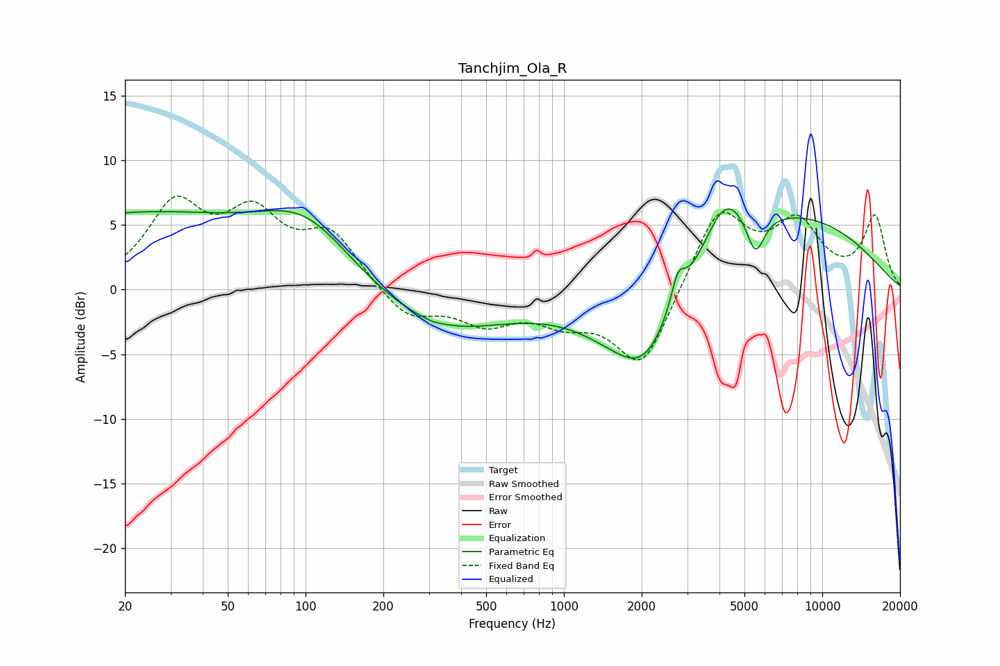

# Tanchjim_Ola_R
See [usage instructions](https://github.com/jaakkopasanen/AutoEq#usage) for more options and info.

### Parametric EQs
Apply preamp of -6.3 dB when using parametric equalizer.

|   # | Type    |   Fc (Hz) |    Q |   Gain (dB) |
|-----|---------|-----------|------|-------------|
|   1 | Peaking |        21 | 0.26 |         5.7 |
|   2 | Peaking |       100 | 0.78 |         4.2 |
|   3 | Peaking |       309 | 5.94 |        -0.1 |
|   4 | Peaking |       331 | 0.55 |        -3.3 |
|   5 | Peaking |      1986 | 0.79 |        -6.5 |
|   6 | Peaking |      2054 | 1.91 |        -1.1 |
|   7 | Peaking |      2763 | 5.34 |         2.4 |
|   8 | Peaking |      4196 | 1.62 |         4.4 |
|   9 | Peaking |      5507 | 3.94 |        -3.2 |
|  10 | Peaking |      7262 | 0.36 |         5.8 |

### Fixed Band EQs
When using fixed band (also called graphic) equalizer, apply preamp of **-7.3 dB** (if available) and set gains manually with these parameters.

|   # | Type    |   Fc (Hz) |    Q |   Gain (dB) |
|-----|---------|-----------|------|-------------|
|   1 | Peaking |        31 | 1.41 |         6.1 |
|   2 | Peaking |        62 | 1.41 |         5   |
|   3 | Peaking |       125 | 1.41 |         4   |
|   4 | Peaking |       250 | 1.41 |        -2.3 |
|   5 | Peaking |       500 | 1.41 |        -2.3 |
|   6 | Peaking |      1000 | 1.41 |        -1.9 |
|   7 | Peaking |      2000 | 1.41 |        -6.2 |
|   8 | Peaking |      4000 | 1.41 |         6.3 |
|   9 | Peaking |      8000 | 1.41 |         4.7 |
|  10 | Peaking |     16000 | 1.41 |         5.5 |

### Graphs

