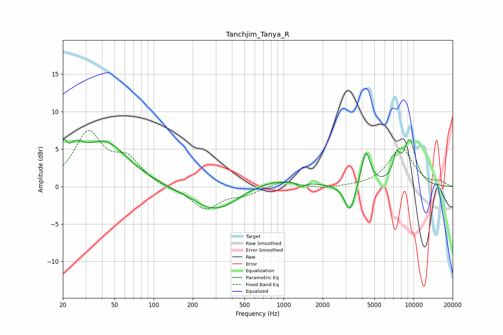

# Tanchjim_Tanya_R
See [usage instructions](https://github.com/jaakkopasanen/AutoEq#usage) for more options and info.

### Parametric EQs
Apply preamp of -6.4 dB when using parametric equalizer.

|   # | Type    |   Fc (Hz) |    Q |   Gain (dB) |
|-----|---------|-----------|------|-------------|
|   1 | Peaking |        20 | 5.93 |         2.8 |
|   2 | Peaking |        25 | 2.24 |         2.6 |
|   3 | Peaking |        42 | 0.8  |         5.7 |
|   4 | Peaking |       301 | 0.78 |        -3.5 |
|   5 | Peaking |       818 | 0.58 |         1.2 |
|   6 | Peaking |      1358 | 5.35 |        -0.6 |
|   7 | Peaking |      3242 | 3.46 |        -3.9 |
|   8 | Peaking |      4280 | 4.02 |         4.8 |
|   9 | Peaking |      7400 | 4.92 |         2.8 |
|  10 | Peaking |      9324 | 2.56 |         5.9 |

### Fixed Band EQs
When using fixed band (also called graphic) equalizer, apply preamp of **-7.6 dB** (if available) and set gains manually with these parameters.

|   # | Type    |   Fc (Hz) |    Q |   Gain (dB) |
|-----|---------|-----------|------|-------------|
|   1 | Peaking |        31 | 1.41 |         6.9 |
|   2 | Peaking |        62 | 1.41 |         3.2 |
|   3 | Peaking |       125 | 1.41 |        -0.3 |
|   4 | Peaking |       250 | 1.41 |        -3   |
|   5 | Peaking |       500 | 1.41 |        -0.9 |
|   6 | Peaking |      1000 | 1.41 |         0.8 |
|   7 | Peaking |      2000 | 1.41 |        -0.3 |
|   8 | Peaking |      4000 | 1.41 |         0   |
|   9 | Peaking |      8000 | 1.41 |         5.1 |
|  10 | Peaking |     16000 | 1.41 |         0.6 |

### Graphs

