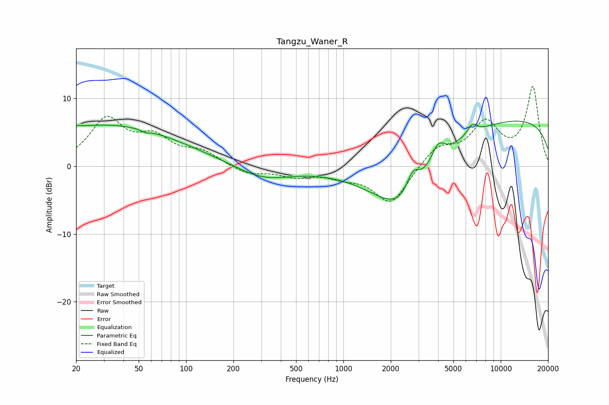

# Tangzu_Waner_R
See [usage instructions](https://github.com/jaakkopasanen/AutoEq#usage) for more options and info.

### Parametric EQs
Apply preamp of -6.7 dB when using parametric equalizer.

|   # | Type    |   Fc (Hz) |    Q |   Gain (dB) |
|-----|---------|-----------|------|-------------|
|   1 | Peaking |        20 | 5.59 |         0.3 |
|   2 | Peaking |        29 | 0.25 |         4.9 |
|   3 | Peaking |        33 | 0.39 |         1.2 |
|   4 | Peaking |        55 | 5.83 |        -0.3 |
|   5 | Peaking |       309 | 0.82 |        -2   |
|   6 | Peaking |      2413 | 0.68 |        -9.6 |
|   7 | Peaking |      2763 | 3.29 |         3.4 |
|   8 | Peaking |      3988 | 3.02 |         3   |
|   9 | Peaking |      6591 | 4.47 |         1.5 |
|  10 | Peaking |     10000 | 0.18 |         7.2 |

### Fixed Band EQs
When using fixed band (also called graphic) equalizer, apply preamp of **-11.8 dB** (if available) and set gains manually with these parameters.

|   # | Type    |   Fc (Hz) |    Q |   Gain (dB) |
|-----|---------|-----------|------|-------------|
|   1 | Peaking |        31 | 1.41 |         6.6 |
|   2 | Peaking |        62 | 1.41 |         3.6 |
|   3 | Peaking |       125 | 1.41 |         1.9 |
|   4 | Peaking |       250 | 1.41 |        -1.2 |
|   5 | Peaking |       500 | 1.41 |        -1.3 |
|   6 | Peaking |      1000 | 1.41 |        -1.2 |
|   7 | Peaking |      2000 | 1.41 |        -5.6 |
|   8 | Peaking |      4000 | 1.41 |         2.8 |
|   9 | Peaking |      8000 | 1.41 |         6   |
|  10 | Peaking |     16000 | 1.41 |        11.5 |

### Graphs

