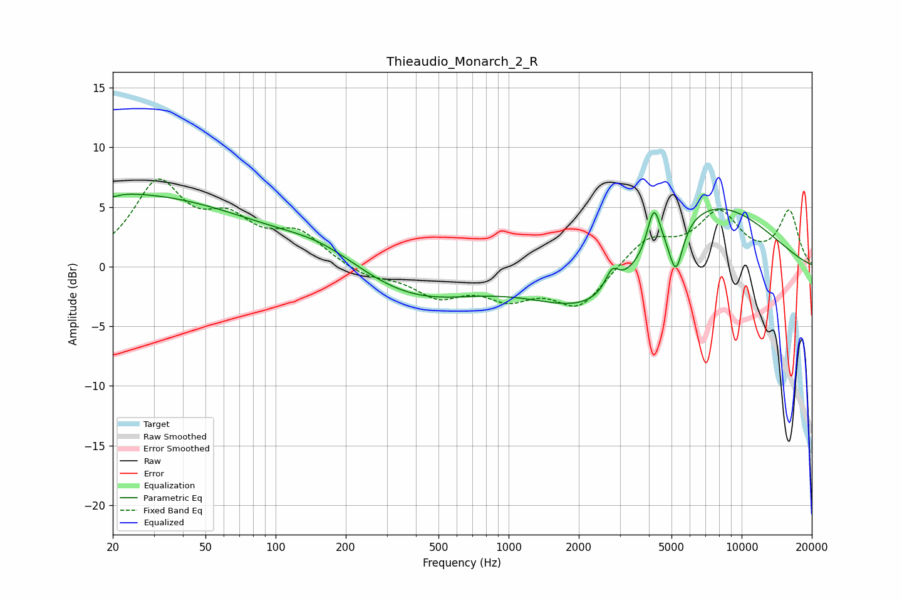

# Thieaudio_Monarch_2_R
See [usage instructions](https://github.com/jaakkopasanen/AutoEq#usage) for more options and info.

### Parametric EQs
Apply preamp of -6.2 dB when using parametric equalizer.

|   # | Type    |   Fc (Hz) |    Q |   Gain (dB) |
|-----|---------|-----------|------|-------------|
|   1 | Peaking |        20 | 5.89 |         3.2 |
|   2 | Peaking |        20 | 0.22 |         6.2 |
|   3 | Peaking |        20 | 5.88 |        -3.5 |
|   4 | Peaking |       157 | 0.82 |         1.5 |
|   5 | Peaking |       397 | 0.55 |        -2.7 |
|   6 | Peaking |      2457 | 0.57 |        -5   |
|   7 | Peaking |      2776 | 4.84 |         1.7 |
|   8 | Peaking |      4199 | 5.07 |         3.7 |
|   9 | Peaking |      5223 | 4.69 |        -3.9 |
|  10 | Peaking |      6730 | 0.46 |         6.3 |

### Fixed Band EQs
When using fixed band (also called graphic) equalizer, apply preamp of **-7.4 dB** (if available) and set gains manually with these parameters.

|   # | Type    |   Fc (Hz) |    Q |   Gain (dB) |
|-----|---------|-----------|------|-------------|
|   1 | Peaking |        31 | 1.41 |         6.7 |
|   2 | Peaking |        62 | 1.41 |         3.2 |
|   3 | Peaking |       125 | 1.41 |         2.6 |
|   4 | Peaking |       250 | 1.41 |        -0.9 |
|   5 | Peaking |       500 | 1.41 |        -2.2 |
|   6 | Peaking |      1000 | 1.41 |        -2.2 |
|   7 | Peaking |      2000 | 1.41 |        -3.3 |
|   8 | Peaking |      4000 | 1.41 |         2.3 |
|   9 | Peaking |      8000 | 1.41 |         4.3 |
|  10 | Peaking |     16000 | 1.41 |         4.5 |

### Graphs

