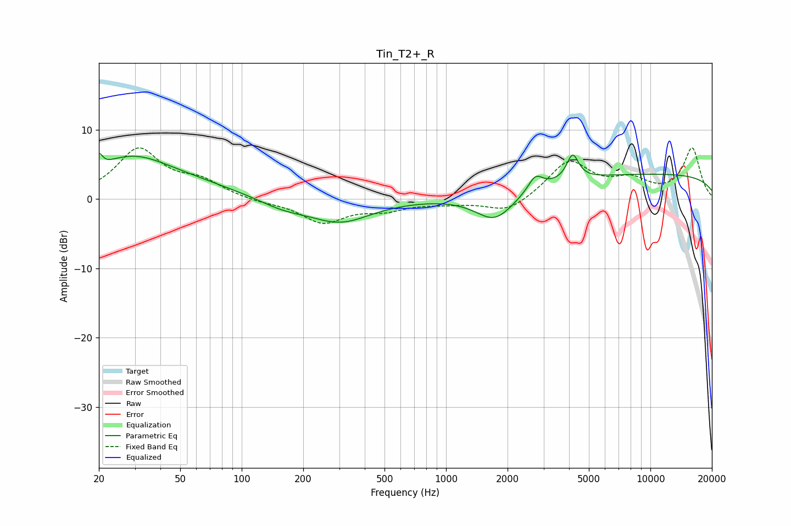

# Tin_T2+_R
See [usage instructions](https://github.com/jaakkopasanen/AutoEq#usage) for more options and info.

### Parametric EQs
Apply preamp of -6.7 dB when using parametric equalizer.

|   # | Type    |   Fc (Hz) |    Q |   Gain (dB) |
|-----|---------|-----------|------|-------------|
|   1 | Peaking |        20 | 6    |         4.6 |
|   2 | Peaking |        20 | 4.41 |        -3.5 |
|   3 | Peaking |        25 | 0.37 |         4.9 |
|   4 | Peaking |        31 | 1.04 |         1.5 |
|   5 | Peaking |       159 | 1.14 |        -1.3 |
|   6 | Peaking |       304 | 0.94 |        -3.2 |
|   7 | Peaking |      1735 | 1.48 |        -4.1 |
|   8 | Peaking |      2738 | 3.98 |         2.1 |
|   9 | Peaking |      4165 | 4.89 |         3.7 |
|  10 | Peaking |     10000 | 0.18 |         3.6 |

### Fixed Band EQs
When using fixed band (also called graphic) equalizer, apply preamp of **-7.5 dB** (if available) and set gains manually with these parameters.

|   # | Type    |   Fc (Hz) |    Q |   Gain (dB) |
|-----|---------|-----------|------|-------------|
|   1 | Peaking |        31 | 1.41 |         7   |
|   2 | Peaking |        62 | 1.41 |         2.2 |
|   3 | Peaking |       125 | 1.41 |        -0.5 |
|   4 | Peaking |       250 | 1.41 |        -3.3 |
|   5 | Peaking |       500 | 1.41 |        -1.3 |
|   6 | Peaking |      1000 | 1.41 |        -0.5 |
|   7 | Peaking |      2000 | 1.41 |        -2.1 |
|   8 | Peaking |      4000 | 1.41 |         5.4 |
|   9 | Peaking |      8000 | 1.41 |         2.3 |
|  10 | Peaking |     16000 | 1.41 |         7.2 |

### Graphs

