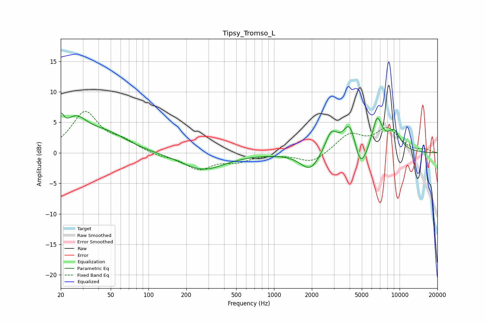

# Tipsy_Tromso_L
See [usage instructions](https://github.com/jaakkopasanen/AutoEq#usage) for more options and info.

### Parametric EQs
Apply preamp of -6.6 dB when using parametric equalizer.

|   # | Type    |   Fc (Hz) |    Q |   Gain (dB) |
|-----|---------|-----------|------|-------------|
|   1 | Peaking |        20 | 5.95 |         3   |
|   2 | Peaking |        26 | 1.49 |         4.4 |
|   3 | Peaking |        46 | 0.83 |         2.8 |
|   4 | Peaking |       272 | 0.82 |        -2.8 |
|   5 | Peaking |      1942 | 1.82 |        -3   |
|   6 | Peaking |      2859 | 2.84 |         3.5 |
|   7 | Peaking |      4014 | 2.69 |         5.1 |
|   8 | Peaking |      4883 | 2.78 |        -4.3 |
|   9 | Peaking |      6627 | 3.37 |         5.3 |
|  10 | Peaking |      9018 | 2.32 |         3.2 |

### Fixed Band EQs
When using fixed band (also called graphic) equalizer, apply preamp of **-6.9 dB** (if available) and set gains manually with these parameters.

|   # | Type    |   Fc (Hz) |    Q |   Gain (dB) |
|-----|---------|-----------|------|-------------|
|   1 | Peaking |        31 | 1.41 |         6.5 |
|   2 | Peaking |        62 | 1.41 |         1.5 |
|   3 | Peaking |       125 | 1.41 |        -0.5 |
|   4 | Peaking |       250 | 1.41 |        -2.6 |
|   5 | Peaking |       500 | 1.41 |        -1.2 |
|   6 | Peaking |      1000 | 1.41 |        -0.1 |
|   7 | Peaking |      2000 | 1.41 |        -1.7 |
|   8 | Peaking |      4000 | 1.41 |         2.9 |
|   9 | Peaking |      8000 | 1.41 |         3.7 |
|  10 | Peaking |     16000 | 1.41 |         0.5 |

### Graphs

