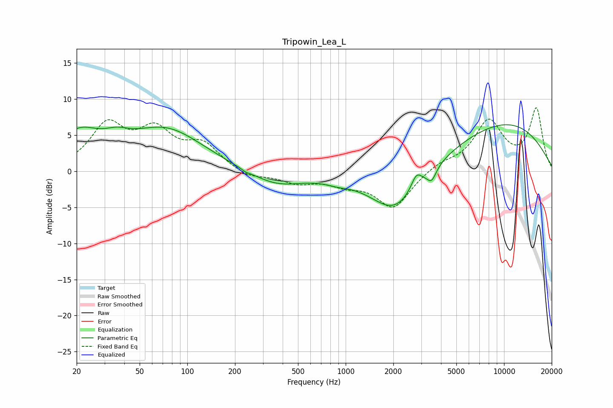

# Tripowin_Lea_L
See [usage instructions](https://github.com/jaakkopasanen/AutoEq#usage) for more options and info.

### Parametric EQs
Apply preamp of -6.5 dB when using parametric equalizer.

|   # | Type    |   Fc (Hz) |    Q |   Gain (dB) |
|-----|---------|-----------|------|-------------|
|   1 | Peaking |        20 | 1.04 |         4.6 |
|   2 | Peaking |        36 | 1.8  |         1.3 |
|   3 | Peaking |        73 | 0.59 |         5.6 |
|   4 | Peaking |       234 | 5.61 |        -0.2 |
|   5 | Peaking |       364 | 0.83 |        -2.1 |
|   6 | Peaking |       889 | 1.82 |        -0.5 |
|   7 | Peaking |      2056 | 0.9  |        -6.1 |
|   8 | Peaking |      2794 | 4.34 |         2   |
|   9 | Peaking |      3492 | 4.98 |        -1.7 |
|  10 | Peaking |      9914 | 0.35 |         6.7 |

### Fixed Band EQs
When using fixed band (also called graphic) equalizer, apply preamp of **-8.9 dB** (if available) and set gains manually with these parameters.

|   # | Type    |   Fc (Hz) |    Q |   Gain (dB) |
|-----|---------|-----------|------|-------------|
|   1 | Peaking |        31 | 1.41 |         6.1 |
|   2 | Peaking |        62 | 1.41 |         5   |
|   3 | Peaking |       125 | 1.41 |         3.4 |
|   4 | Peaking |       250 | 1.41 |        -1   |
|   5 | Peaking |       500 | 1.41 |        -1.4 |
|   6 | Peaking |      1000 | 1.41 |        -1.5 |
|   7 | Peaking |      2000 | 1.41 |        -5   |
|   8 | Peaking |      4000 | 1.41 |         1   |
|   9 | Peaking |      8000 | 1.41 |         6.7 |
|  10 | Peaking |     16000 | 1.41 |         8.5 |

### Graphs

