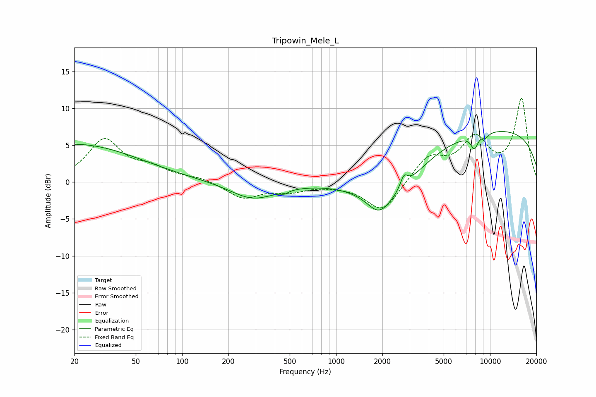

# Tripowin_Mele_L
See [usage instructions](https://github.com/jaakkopasanen/AutoEq#usage) for more options and info.

### Parametric EQs
Apply preamp of -6.9 dB when using parametric equalizer.

|   # | Type    |   Fc (Hz) |    Q |   Gain (dB) |
|-----|---------|-----------|------|-------------|
|   1 | Peaking |        20 | 0.34 |         5.1 |
|   2 | Peaking |       288 | 0.96 |        -2.3 |
|   3 | Peaking |       462 | 5.99 |        -0.4 |
|   4 | Peaking |      1890 | 1.99 |        -2.3 |
|   5 | Peaking |      2294 | 0.71 |        -4.9 |
|   6 | Peaking |      2758 | 5.92 |         1.7 |
|   7 | Peaking |      7905 | 5.72 |        -1.9 |
|   8 | Peaking |      9315 | 5.9  |        -0.4 |
|   9 | Peaking |      9426 | 5.69 |        -0.2 |
|  10 | Peaking |      9818 | 0.2  |         7.3 |

### Fixed Band EQs
When using fixed band (also called graphic) equalizer, apply preamp of **-11.5 dB** (if available) and set gains manually with these parameters.

|   # | Type    |   Fc (Hz) |    Q |   Gain (dB) |
|-----|---------|-----------|------|-------------|
|   1 | Peaking |        31 | 1.41 |         5.6 |
|   2 | Peaking |        62 | 1.41 |         1.6 |
|   3 | Peaking |       125 | 1.41 |         0.6 |
|   4 | Peaking |       250 | 1.41 |        -2.1 |
|   5 | Peaking |       500 | 1.41 |        -1.1 |
|   6 | Peaking |      1000 | 1.41 |        -0.2 |
|   7 | Peaking |      2000 | 1.41 |        -4.1 |
|   8 | Peaking |      4000 | 1.41 |         3.3 |
|   9 | Peaking |      8000 | 1.41 |         5.4 |
|  10 | Peaking |     16000 | 1.41 |        11.1 |

### Graphs

