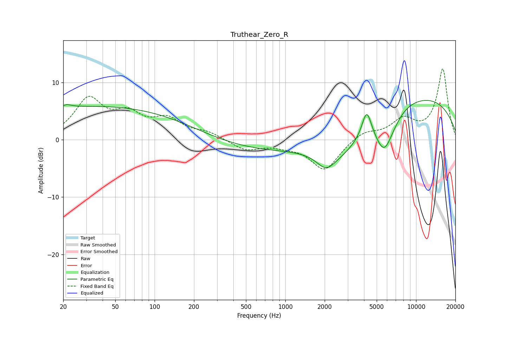

# Truthear_Zero_R
See [usage instructions](https://github.com/jaakkopasanen/AutoEq#usage) for more options and info.

### Parametric EQs
Apply preamp of -7.0 dB when using parametric equalizer.

|   # | Type    |   Fc (Hz) |    Q |   Gain (dB) |
|-----|---------|-----------|------|-------------|
|   1 | Peaking |        20 | 5.91 |        -0.6 |
|   2 | Peaking |        20 | 3.89 |         1.1 |
|   3 | Peaking |        37 | 0.18 |         5.9 |
|   4 | Peaking |       957 | 0.25 |        -2.3 |
|   5 | Peaking |      2047 | 2.08 |        -2.4 |
|   6 | Peaking |      2678 | 0.68 |        -5.7 |
|   7 | Peaking |      4193 | 3.9  |         4.8 |
|   8 | Peaking |      5701 | 1.99 |        -6.4 |
|   9 | Peaking |      6840 | 2.16 |        -0.6 |
|  10 | Peaking |      8249 | 0.21 |         8.2 |

### Fixed Band EQs
When using fixed band (also called graphic) equalizer, apply preamp of **-12.5 dB** (if available) and set gains manually with these parameters.

|   # | Type    |   Fc (Hz) |    Q |   Gain (dB) |
|-----|---------|-----------|------|-------------|
|   1 | Peaking |        31 | 1.41 |         6.8 |
|   2 | Peaking |        62 | 1.41 |         3.7 |
|   3 | Peaking |       125 | 1.41 |         3.2 |
|   4 | Peaking |       250 | 1.41 |         1.1 |
|   5 | Peaking |       500 | 1.41 |        -1.8 |
|   6 | Peaking |      1000 | 1.41 |        -0.7 |
|   7 | Peaking |      2000 | 1.41 |        -5.3 |
|   8 | Peaking |      4000 | 1.41 |         1.5 |
|   9 | Peaking |      8000 | 1.41 |         3.2 |
|  10 | Peaking |     16000 | 1.41 |        12.3 |

### Graphs

