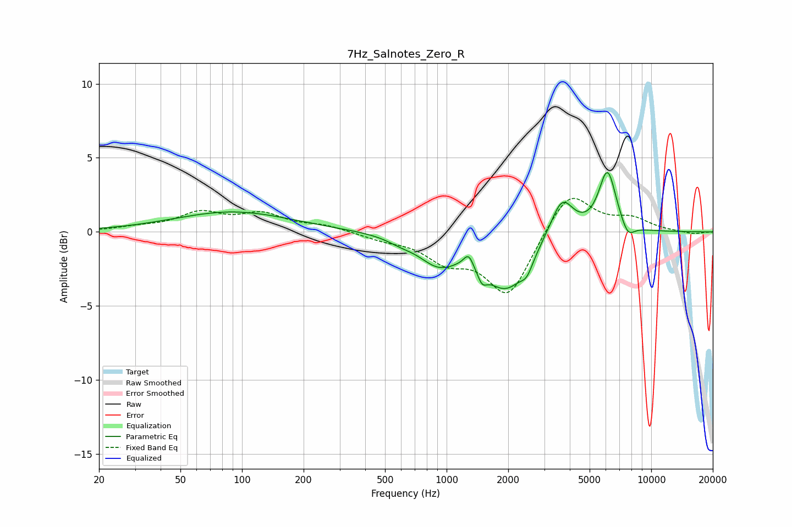

# 7Hz_Salnotes_Zero_R
See [usage instructions](https://github.com/jaakkopasanen/AutoEq#usage) for more options and info.

### Parametric EQs
Apply preamp of -4.1 dB when using parametric equalizer.

|   # | Type    |   Fc (Hz) |    Q |   Gain (dB) |
|-----|---------|-----------|------|-------------|
|   1 | Peaking |        90 | 0.5  |         1.4 |
|   2 | Peaking |       591 | 2.24 |        -0.3 |
|   3 | Peaking |       910 | 1.46 |        -1.8 |
|   4 | Peaking |      1280 | 6    |         0.9 |
|   5 | Peaking |      1491 | 6    |        -0.9 |
|   6 | Peaking |      1952 | 1.32 |        -3.6 |
|   7 | Peaking |      2469 | 4.91 |        -0.9 |
|   8 | Peaking |      3662 | 2.51 |         2.6 |
|   9 | Peaking |      6113 | 3.19 |         4.1 |
|  10 | Peaking |      7679 | 4.11 |        -1   |

### Fixed Band EQs
When using fixed band (also called graphic) equalizer, apply preamp of **-2.4 dB** (if available) and set gains manually with these parameters.

|   # | Type    |   Fc (Hz) |    Q |   Gain (dB) |
|-----|---------|-----------|------|-------------|
|   1 | Peaking |        31 | 1.41 |         0.2 |
|   2 | Peaking |        62 | 1.41 |         1.2 |
|   3 | Peaking |       125 | 1.41 |         1.1 |
|   4 | Peaking |       250 | 1.41 |         0.4 |
|   5 | Peaking |       500 | 1.41 |        -0.4 |
|   6 | Peaking |      1000 | 1.41 |        -1.7 |
|   7 | Peaking |      2000 | 1.41 |        -4.3 |
|   8 | Peaking |      4000 | 1.41 |         2.9 |
|   9 | Peaking |      8000 | 1.41 |         0.8 |
|  10 | Peaking |     16000 | 1.41 |        -0.2 |

### Graphs

