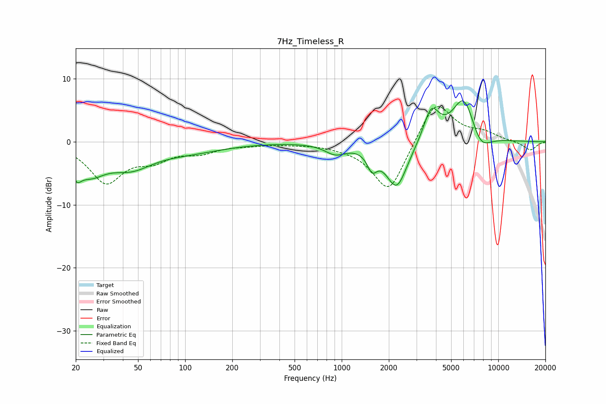

# 7Hz_Timeless_R
See [usage instructions](https://github.com/jaakkopasanen/AutoEq#usage) for more options and info.

### Parametric EQs
Apply preamp of -6.6 dB when using parametric equalizer.

|   # | Type    |   Fc (Hz) |    Q |   Gain (dB) |
|-----|---------|-----------|------|-------------|
|   1 | Peaking |        20 | 4.63 |        -2.5 |
|   2 | Peaking |        25 | 1.43 |        -4   |
|   3 | Peaking |        45 | 1.02 |        -3.3 |
|   4 | Peaking |       105 | 0.62 |        -1.4 |
|   5 | Peaking |       911 | 2.12 |        -1.6 |
|   6 | Peaking |      1562 | 4.57 |        -2.7 |
|   7 | Peaking |      2243 | 2.01 |        -7.4 |
|   8 | Peaking |      3733 | 2.8  |         5.2 |
|   9 | Peaking |      6040 | 1.8  |         7.6 |
|  10 | Peaking |      7648 | 2.03 |        -3.3 |

### Fixed Band EQs
When using fixed band (also called graphic) equalizer, apply preamp of **-5.7 dB** (if available) and set gains manually with these parameters.

|   # | Type    |   Fc (Hz) |    Q |   Gain (dB) |
|-----|---------|-----------|------|-------------|
|   1 | Peaking |        31 | 1.41 |        -6.2 |
|   2 | Peaking |        62 | 1.41 |        -2.3 |
|   3 | Peaking |       125 | 1.41 |        -1.4 |
|   4 | Peaking |       250 | 1.41 |        -0.4 |
|   5 | Peaking |       500 | 1.41 |        -0.2 |
|   6 | Peaking |      1000 | 1.41 |        -0.4 |
|   7 | Peaking |      2000 | 1.41 |        -8.3 |
|   8 | Peaking |      4000 | 1.41 |         6.9 |
|   9 | Peaking |      8000 | 1.41 |         1.2 |
|  10 | Peaking |     16000 | 1.41 |        -1.4 |

### Graphs

