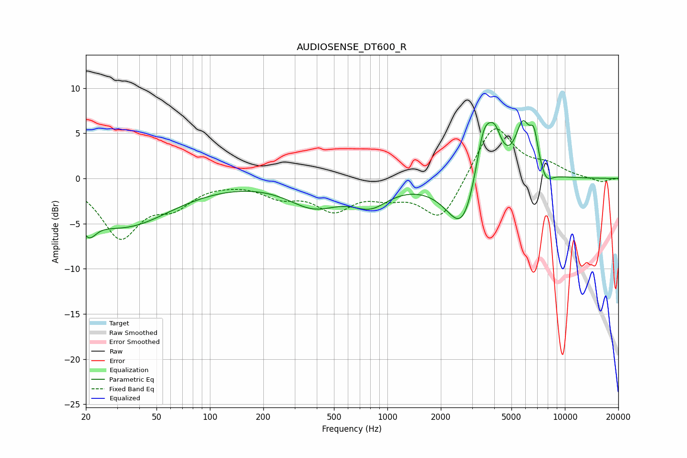

# AUDIOSENSE_DT600_R
See [usage instructions](https://github.com/jaakkopasanen/AutoEq#usage) for more options and info.

### Parametric EQs
Apply preamp of -6.5 dB when using parametric equalizer.

|   # | Type    |   Fc (Hz) |    Q |   Gain (dB) |
|-----|---------|-----------|------|-------------|
|   1 | Peaking |        21 | 3.4  |        -2.3 |
|   2 | Peaking |        32 | 0.52 |        -5.2 |
|   3 | Peaking |       385 | 0.96 |        -2.8 |
|   4 | Peaking |       805 | 1.38 |        -2.3 |
|   5 | Peaking |      2666 | 1.58 |        -6.4 |
|   6 | Peaking |      3489 | 2.82 |         6.8 |
|   7 | Peaking |      4032 | 3.48 |         3.5 |
|   8 | Peaking |      5790 | 3.15 |         5.5 |
|   9 | Peaking |      6701 | 5.69 |         3.4 |
|  10 | Peaking |      7848 | 3.93 |        -1.3 |

### Fixed Band EQs
When using fixed band (also called graphic) equalizer, apply preamp of **-5.6 dB** (if available) and set gains manually with these parameters.

|   # | Type    |   Fc (Hz) |    Q |   Gain (dB) |
|-----|---------|-----------|------|-------------|
|   1 | Peaking |        31 | 1.41 |        -6.3 |
|   2 | Peaking |        62 | 1.41 |        -2.5 |
|   3 | Peaking |       125 | 1.41 |        -0.1 |
|   4 | Peaking |       250 | 1.41 |        -1.7 |
|   5 | Peaking |       500 | 1.41 |        -3.1 |
|   6 | Peaking |      1000 | 1.41 |        -1.4 |
|   7 | Peaking |      2000 | 1.41 |        -4.7 |
|   8 | Peaking |      4000 | 1.41 |         6.2 |
|   9 | Peaking |      8000 | 1.41 |         1.2 |
|  10 | Peaking |     16000 | 1.41 |        -0.5 |

### Graphs

