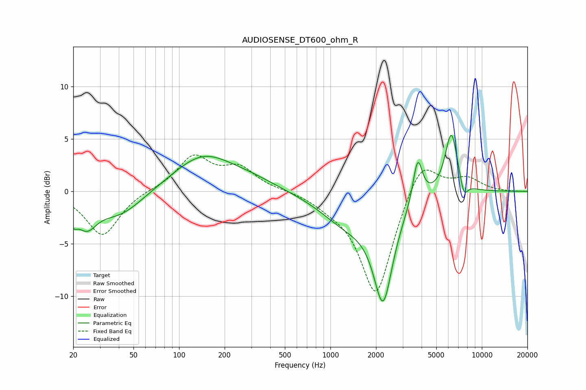

# AUDIOSENSE_DT600_ohm_R
See [usage instructions](https://github.com/jaakkopasanen/AutoEq#usage) for more options and info.

### Parametric EQs
Apply preamp of -5.4 dB when using parametric equalizer.

|   # | Type    |   Fc (Hz) |    Q |   Gain (dB) |
|-----|---------|-----------|------|-------------|
|   1 | Peaking |        20 | 5.29 |        -1.4 |
|   2 | Peaking |        24 | 2.12 |        -2.6 |
|   3 | Peaking |        41 | 0.91 |        -2.3 |
|   4 | Peaking |       143 | 0.72 |         3.3 |
|   5 | Peaking |       297 | 0.78 |         0.8 |
|   6 | Peaking |      1305 | 0.78 |        -2.8 |
|   7 | Peaking |      2229 | 2.19 |        -9.2 |
|   8 | Peaking |      3768 | 4.44 |         4.3 |
|   9 | Peaking |      6289 | 3.24 |         5.9 |
|  10 | Peaking |      7603 | 5.21 |        -1.7 |

### Fixed Band EQs
When using fixed band (also called graphic) equalizer, apply preamp of **-3.6 dB** (if available) and set gains manually with these parameters.

|   # | Type    |   Fc (Hz) |    Q |   Gain (dB) |
|-----|---------|-----------|------|-------------|
|   1 | Peaking |        31 | 1.41 |        -4.3 |
|   2 | Peaking |        62 | 1.41 |         0.1 |
|   3 | Peaking |       125 | 1.41 |         3.2 |
|   4 | Peaking |       250 | 1.41 |         2.1 |
|   5 | Peaking |       500 | 1.41 |         0.1 |
|   6 | Peaking |      1000 | 1.41 |        -0.8 |
|   7 | Peaking |      2000 | 1.41 |       -10   |
|   8 | Peaking |      4000 | 1.41 |         3.6 |
|   9 | Peaking |      8000 | 1.41 |         1.2 |
|  10 | Peaking |     16000 | 1.41 |        -0   |

### Graphs

