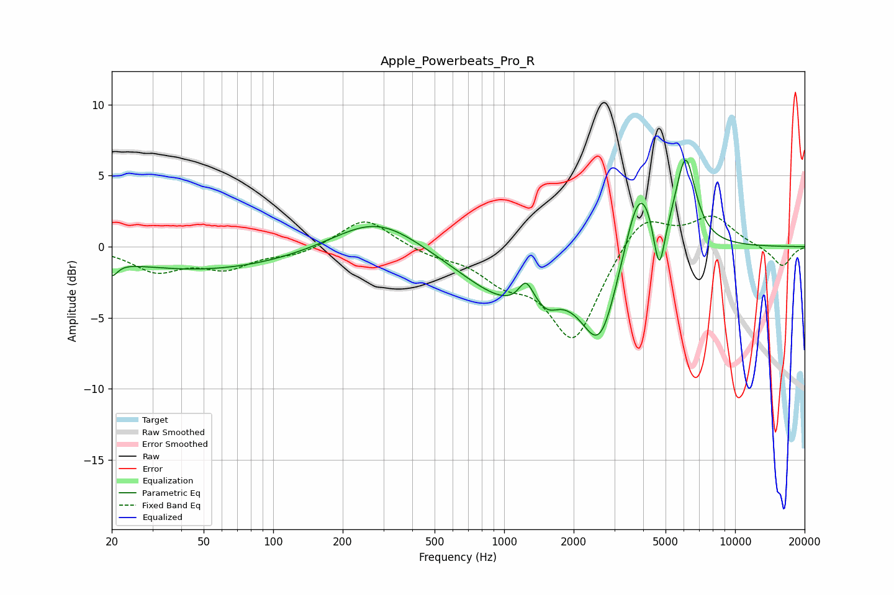

# Apple_Powerbeats_Pro_R
See [usage instructions](https://github.com/jaakkopasanen/AutoEq#usage) for more options and info.

### Parametric EQs
Apply preamp of -6.2 dB when using parametric equalizer.

|   # | Type    |   Fc (Hz) |    Q |   Gain (dB) |
|-----|---------|-----------|------|-------------|
|   1 | Peaking |        20 | 5.75 |        -1   |
|   2 | Peaking |        50 | 0.35 |        -1.7 |
|   3 | Peaking |       281 | 0.78 |         2.3 |
|   4 | Peaking |      1080 | 0.67 |        -3.7 |
|   5 | Peaking |      1243 | 4.56 |         1.6 |
|   6 | Peaking |      1547 | 3.37 |        -0.8 |
|   7 | Peaking |      2603 | 1.74 |        -6.3 |
|   8 | Peaking |      3865 | 2.04 |         5.8 |
|   9 | Peaking |      4692 | 5.54 |        -4.3 |
|  10 | Peaking |      6108 | 3.19 |         6.1 |

### Fixed Band EQs
When using fixed band (also called graphic) equalizer, apply preamp of **-2.3 dB** (if available) and set gains manually with these parameters.

|   # | Type    |   Fc (Hz) |    Q |   Gain (dB) |
|-----|---------|-----------|------|-------------|
|   1 | Peaking |        31 | 1.41 |        -1.6 |
|   2 | Peaking |        62 | 1.41 |        -1.4 |
|   3 | Peaking |       125 | 1.41 |        -0.6 |
|   4 | Peaking |       250 | 1.41 |         2.1 |
|   5 | Peaking |       500 | 1.41 |        -0.5 |
|   6 | Peaking |      1000 | 1.41 |        -1.9 |
|   7 | Peaking |      2000 | 1.41 |        -6.5 |
|   8 | Peaking |      4000 | 1.41 |         2.5 |
|   9 | Peaking |      8000 | 1.41 |         2.1 |
|  10 | Peaking |     16000 | 1.41 |        -1.4 |

### Graphs

