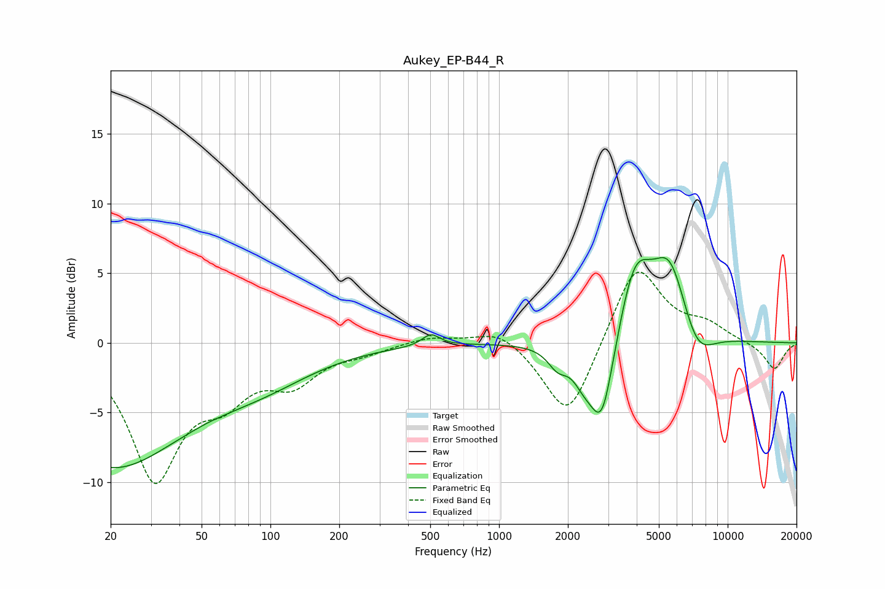

# Aukey_EP-B44_R
See [usage instructions](https://github.com/jaakkopasanen/AutoEq#usage) for more options and info.

### Parametric EQs
Apply preamp of -6.2 dB when using parametric equalizer.

|   # | Type    |   Fc (Hz) |    Q |   Gain (dB) |
|-----|---------|-----------|------|-------------|
|   1 | Peaking |        20 | 0.43 |        -8.7 |
|   2 | Peaking |        54 | 5.81 |         0   |
|   3 | Peaking |        92 | 0.6  |        -2   |
|   4 | Peaking |       503 | 3.67 |         0.9 |
|   5 | Peaking |      1806 | 3.24 |        -1.3 |
|   6 | Peaking |      2342 | 2.84 |        -1.7 |
|   7 | Peaking |      2820 | 2.61 |        -6.3 |
|   8 | Peaking |      3931 | 1.92 |         5.3 |
|   9 | Peaking |      5592 | 1.7  |         5.7 |
|  10 | Peaking |      7284 | 1.82 |        -2.6 |

### Fixed Band EQs
When using fixed band (also called graphic) equalizer, apply preamp of **-5.2 dB** (if available) and set gains manually with these parameters.

|   # | Type    |   Fc (Hz) |    Q |   Gain (dB) |
|-----|---------|-----------|------|-------------|
|   1 | Peaking |        31 | 1.41 |        -9.5 |
|   2 | Peaking |        62 | 1.41 |        -2.9 |
|   3 | Peaking |       125 | 1.41 |        -2.5 |
|   4 | Peaking |       250 | 1.41 |        -0.5 |
|   5 | Peaking |       500 | 1.41 |         0.5 |
|   6 | Peaking |      1000 | 1.41 |         1.1 |
|   7 | Peaking |      2000 | 1.41 |        -5.7 |
|   8 | Peaking |      4000 | 1.41 |         5.9 |
|   9 | Peaking |      8000 | 1.41 |         1.1 |
|  10 | Peaking |     16000 | 1.41 |        -1.9 |

### Graphs

