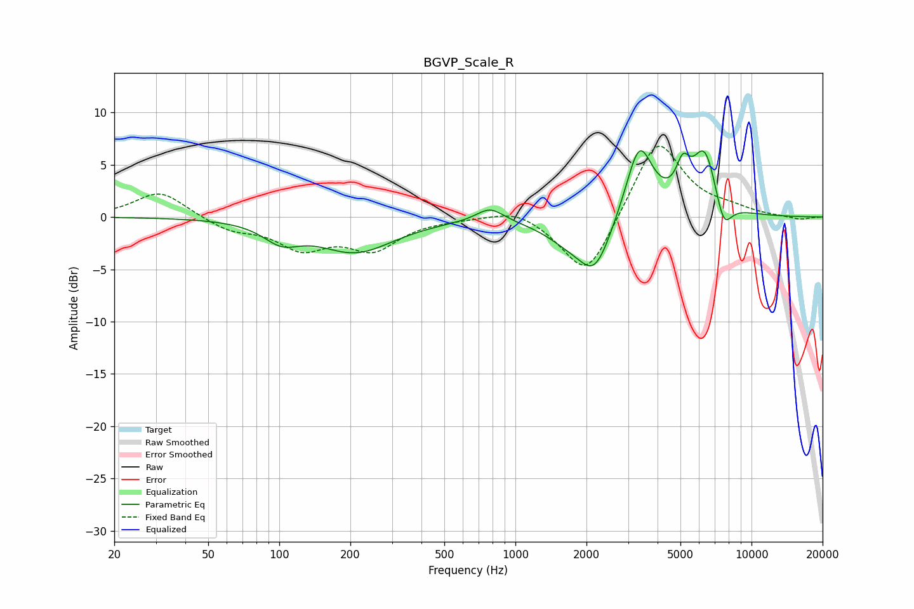

# BGVP_Scale_R
See [usage instructions](https://github.com/jaakkopasanen/AutoEq#usage) for more options and info.

### Parametric EQs
Apply preamp of -6.4 dB when using parametric equalizer.

|   # | Type    |   Fc (Hz) |    Q |   Gain (dB) |
|-----|---------|-----------|------|-------------|
|   1 | Peaking |       102 | 1.81 |        -1.8 |
|   2 | Peaking |       129 | 0.79 |         0.2 |
|   3 | Peaking |       209 | 0.86 |        -3.3 |
|   4 | Peaking |       781 | 2.42 |         1.4 |
|   5 | Peaking |      1671 | 1.37 |        -1.7 |
|   6 | Peaking |      2174 | 2    |        -4.8 |
|   7 | Peaking |      3346 | 2.43 |         7.2 |
|   8 | Peaking |      5116 | 4.9  |         2.9 |
|   9 | Peaking |      6340 | 2.51 |         6.3 |
|  10 | Peaking |      7603 | 3.77 |        -3.1 |

### Fixed Band EQs
When using fixed band (also called graphic) equalizer, apply preamp of **-6.9 dB** (if available) and set gains manually with these parameters.

|   # | Type    |   Fc (Hz) |    Q |   Gain (dB) |
|-----|---------|-----------|------|-------------|
|   1 | Peaking |        31 | 1.41 |         2.5 |
|   2 | Peaking |        62 | 1.41 |        -1.2 |
|   3 | Peaking |       125 | 1.41 |        -2.7 |
|   4 | Peaking |       250 | 1.41 |        -2.9 |
|   5 | Peaking |       500 | 1.41 |        -0.1 |
|   6 | Peaking |      1000 | 1.41 |         1   |
|   7 | Peaking |      2000 | 1.41 |        -6.1 |
|   8 | Peaking |      4000 | 1.41 |         7.7 |
|   9 | Peaking |      8000 | 1.41 |         0.6 |
|  10 | Peaking |     16000 | 1.41 |        -0.3 |

### Graphs

