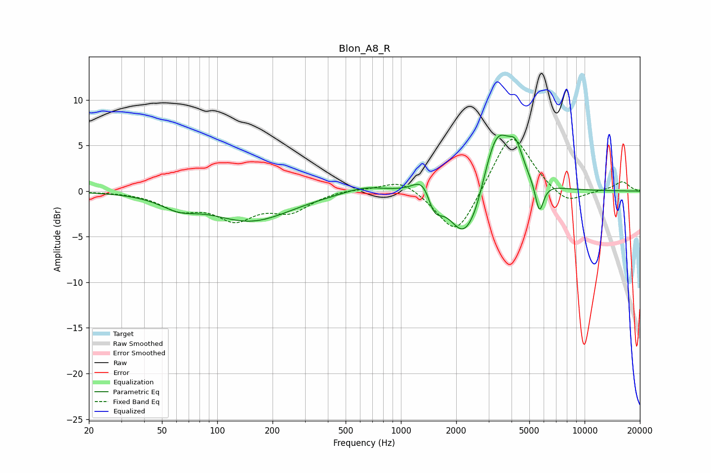

# Blon_A8_R
See [usage instructions](https://github.com/jaakkopasanen/AutoEq#usage) for more options and info.

### Parametric EQs
Apply preamp of -6.2 dB when using parametric equalizer.

|   # | Type    |   Fc (Hz) |    Q |   Gain (dB) |
|-----|---------|-----------|------|-------------|
|   1 | Peaking |        61 | 1.45 |        -1.2 |
|   2 | Peaking |       153 | 0.65 |        -3.2 |
|   3 | Peaking |       637 | 1.25 |         0.8 |
|   4 | Peaking |      1341 | 2.55 |         2.7 |
|   5 | Peaking |      1510 | 3.32 |        -2.9 |
|   6 | Peaking |      2193 | 1.8  |        -5.5 |
|   7 | Peaking |      2578 | 2.83 |        -1.6 |
|   8 | Peaking |      3329 | 1.76 |         7.3 |
|   9 | Peaking |      4227 | 3.72 |         2.7 |
|  10 | Peaking |      5674 | 6    |        -3.4 |

### Fixed Band EQs
When using fixed band (also called graphic) equalizer, apply preamp of **-5.8 dB** (if available) and set gains manually with these parameters.

|   # | Type    |   Fc (Hz) |    Q |   Gain (dB) |
|-----|---------|-----------|------|-------------|
|   1 | Peaking |        31 | 1.41 |        -0   |
|   2 | Peaking |        62 | 1.41 |        -1.8 |
|   3 | Peaking |       125 | 1.41 |        -2.8 |
|   4 | Peaking |       250 | 1.41 |        -2   |
|   5 | Peaking |       500 | 1.41 |         0.3 |
|   6 | Peaking |      1000 | 1.41 |         1.5 |
|   7 | Peaking |      2000 | 1.41 |        -5.3 |
|   8 | Peaking |      4000 | 1.41 |         6.8 |
|   9 | Peaking |      8000 | 1.41 |        -1.7 |
|  10 | Peaking |     16000 | 1.41 |         1   |

### Graphs

