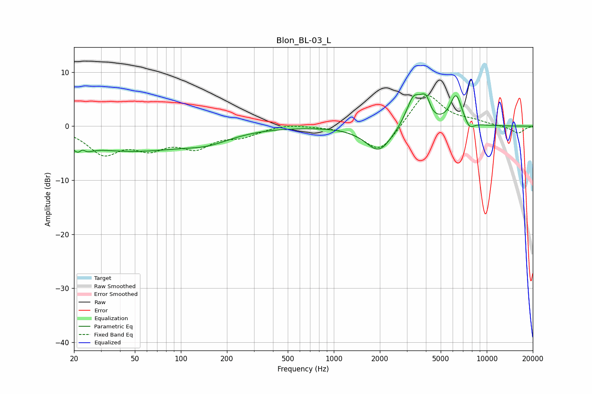

# Blon_BL-03_L
See [usage instructions](https://github.com/jaakkopasanen/AutoEq#usage) for more options and info.

### Parametric EQs
Apply preamp of -6.1 dB when using parametric equalizer.

|   # | Type    |   Fc (Hz) |    Q |   Gain (dB) |
|-----|---------|-----------|------|-------------|
|   1 | Peaking |        22 | 3.85 |        -4.3 |
|   2 | Peaking |        23 | 5.75 |         3.2 |
|   3 | Peaking |        46 | 0.36 |        -4.4 |
|   4 | Peaking |       151 | 0.93 |        -1.6 |
|   5 | Peaking |      1971 | 1.64 |        -4.8 |
|   6 | Peaking |      3332 | 2.77 |         5.8 |
|   7 | Peaking |      3849 | 5.08 |         1.7 |
|   8 | Peaking |      4067 | 6    |         1.9 |
|   9 | Peaking |      6299 | 3.43 |         5.7 |
|  10 | Peaking |      7697 | 4.38 |        -1.6 |

### Fixed Band EQs
When using fixed band (also called graphic) equalizer, apply preamp of **-5.8 dB** (if available) and set gains manually with these parameters.

|   # | Type    |   Fc (Hz) |    Q |   Gain (dB) |
|-----|---------|-----------|------|-------------|
|   1 | Peaking |        31 | 1.41 |        -4.7 |
|   2 | Peaking |        62 | 1.41 |        -3.4 |
|   3 | Peaking |       125 | 1.41 |        -3.4 |
|   4 | Peaking |       250 | 1.41 |        -1.6 |
|   5 | Peaking |       500 | 1.41 |         0.5 |
|   6 | Peaking |      1000 | 1.41 |         0   |
|   7 | Peaking |      2000 | 1.41 |        -5.1 |
|   8 | Peaking |      4000 | 1.41 |         6.5 |
|   9 | Peaking |      8000 | 1.41 |         0.7 |
|  10 | Peaking |     16000 | 1.41 |        -1.3 |

### Graphs

