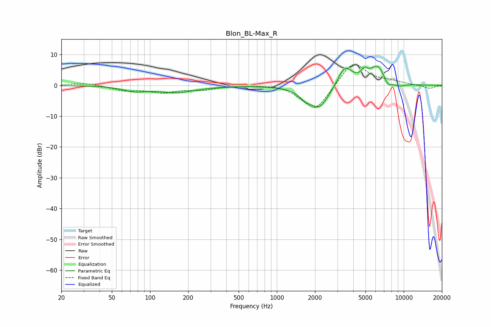

# Blon_BL-Max_R
See [usage instructions](https://github.com/jaakkopasanen/AutoEq#usage) for more options and info.

### Parametric EQs
Apply preamp of -6.3 dB when using parametric equalizer.

|   # | Type    |   Fc (Hz) |    Q |   Gain (dB) |
|-----|---------|-----------|------|-------------|
|   1 | Peaking |        75 | 1.65 |        -1.5 |
|   2 | Peaking |       135 | 0.89 |         0.2 |
|   3 | Peaking |       158 | 0.91 |        -2.4 |
|   4 | Peaking |      1667 | 3.35 |        -1.7 |
|   5 | Peaking |      2152 | 1.72 |        -7.7 |
|   6 | Peaking |      3430 | 2.43 |         6.6 |
|   7 | Peaking |      4894 | 5.97 |         2.2 |
|   8 | Peaking |      6329 | 1.82 |         7.2 |
|   9 | Peaking |      7430 | 3.36 |        -3.7 |
|  10 | Peaking |      9167 | 2.36 |        -1.2 |

### Fixed Band EQs
When using fixed band (also called graphic) equalizer, apply preamp of **-6.9 dB** (if available) and set gains manually with these parameters.

|   # | Type    |   Fc (Hz) |    Q |   Gain (dB) |
|-----|---------|-----------|------|-------------|
|   1 | Peaking |        31 | 1.41 |         0.8 |
|   2 | Peaking |        62 | 1.41 |        -1.5 |
|   3 | Peaking |       125 | 1.41 |        -2   |
|   4 | Peaking |       250 | 1.41 |        -1.2 |
|   5 | Peaking |       500 | 1.41 |        -0   |
|   6 | Peaking |      1000 | 1.41 |         0.7 |
|   7 | Peaking |      2000 | 1.41 |        -8.8 |
|   8 | Peaking |      4000 | 1.41 |         8.2 |
|   9 | Peaking |      8000 | 1.41 |         1   |
|  10 | Peaking |     16000 | 1.41 |        -1   |

### Graphs

