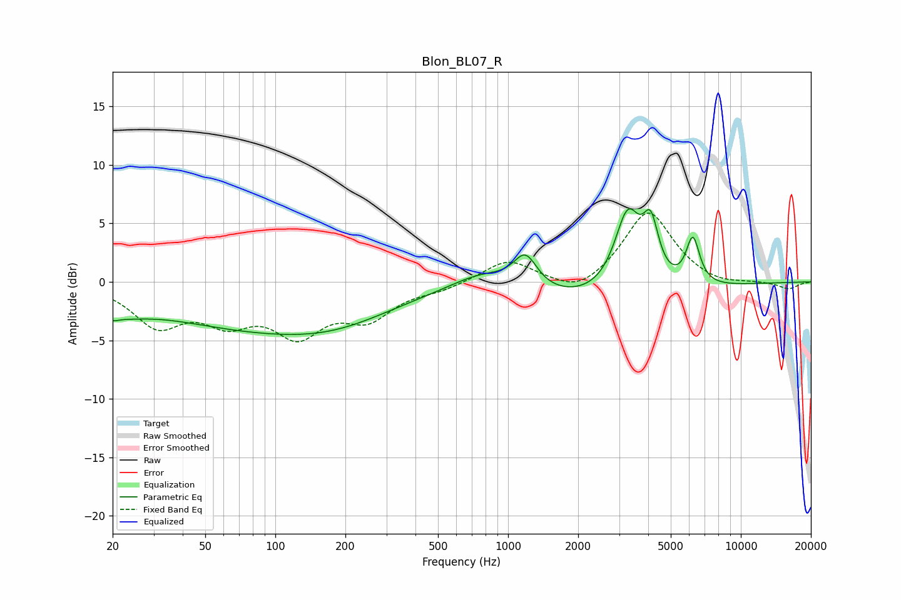

# Blon_BL07_R
See [usage instructions](https://github.com/jaakkopasanen/AutoEq#usage) for more options and info.

### Parametric EQs
Apply preamp of -6.3 dB when using parametric equalizer.

|   # | Type    |   Fc (Hz) |    Q |   Gain (dB) |
|-----|---------|-----------|------|-------------|
|   1 | Peaking |        20 | 5.89 |        -0.4 |
|   2 | Peaking |        21 | 1.11 |        -1.5 |
|   3 | Peaking |        89 | 0.31 |        -3.8 |
|   4 | Peaking |       183 | 0.6  |        -1.1 |
|   5 | Peaking |       783 | 1    |         1.7 |
|   6 | Peaking |      1188 | 2.79 |         2.8 |
|   7 | Peaking |      2386 | 0.39 |        -1.9 |
|   8 | Peaking |      3265 | 2.47 |         6.9 |
|   9 | Peaking |      4103 | 4.19 |         4.5 |
|  10 | Peaking |      6220 | 4.68 |         4   |

### Fixed Band EQs
When using fixed band (also called graphic) equalizer, apply preamp of **-6.0 dB** (if available) and set gains manually with these parameters.

|   # | Type    |   Fc (Hz) |    Q |   Gain (dB) |
|-----|---------|-----------|------|-------------|
|   1 | Peaking |        31 | 1.41 |        -3.5 |
|   2 | Peaking |        62 | 1.41 |        -2.8 |
|   3 | Peaking |       125 | 1.41 |        -4   |
|   4 | Peaking |       250 | 1.41 |        -2.7 |
|   5 | Peaking |       500 | 1.41 |        -0.6 |
|   6 | Peaking |      1000 | 1.41 |         1.9 |
|   7 | Peaking |      2000 | 1.41 |        -1.3 |
|   8 | Peaking |      4000 | 1.41 |         6.1 |
|   9 | Peaking |      8000 | 1.41 |        -0.4 |
|  10 | Peaking |     16000 | 1.41 |        -0.6 |

### Graphs

