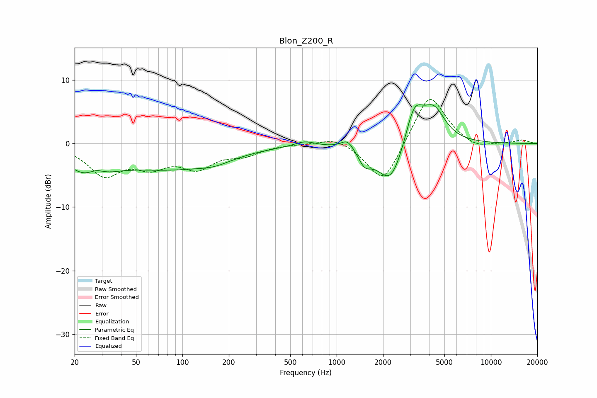

# Blon_Z200_R
See [usage instructions](https://github.com/jaakkopasanen/AutoEq#usage) for more options and info.

### Parametric EQs
Apply preamp of -6.2 dB when using parametric equalizer.

|   # | Type    |   Fc (Hz) |    Q |   Gain (dB) |
|-----|---------|-----------|------|-------------|
|   1 | Peaking |        25 | 1.05 |        -4.3 |
|   2 | Peaking |        27 | 2.6  |         1.5 |
|   3 | Peaking |        84 | 0.41 |        -3.6 |
|   4 | Peaking |       162 | 1.35 |        -0.8 |
|   5 | Peaking |       621 | 2.16 |         0.8 |
|   6 | Peaking |      1178 | 3.36 |         1.6 |
|   7 | Peaking |      1519 | 3.51 |        -2.1 |
|   8 | Peaking |      2246 | 1.56 |        -7   |
|   9 | Peaking |      3180 | 2.31 |         6.5 |
|  10 | Peaking |      4278 | 1.89 |         5.1 |

### Fixed Band EQs
When using fixed band (also called graphic) equalizer, apply preamp of **-7.0 dB** (if available) and set gains manually with these parameters.

|   # | Type    |   Fc (Hz) |    Q |   Gain (dB) |
|-----|---------|-----------|------|-------------|
|   1 | Peaking |        31 | 1.41 |        -4.7 |
|   2 | Peaking |        62 | 1.41 |        -3   |
|   3 | Peaking |       125 | 1.41 |        -3.4 |
|   4 | Peaking |       250 | 1.41 |        -1.5 |
|   5 | Peaking |       500 | 1.41 |         0   |
|   6 | Peaking |      1000 | 1.41 |         1.2 |
|   7 | Peaking |      2000 | 1.41 |        -6.7 |
|   8 | Peaking |      4000 | 1.41 |         8.2 |
|   9 | Peaking |      8000 | 1.41 |        -1.1 |
|  10 | Peaking |     16000 | 1.41 |         0.6 |

### Graphs

