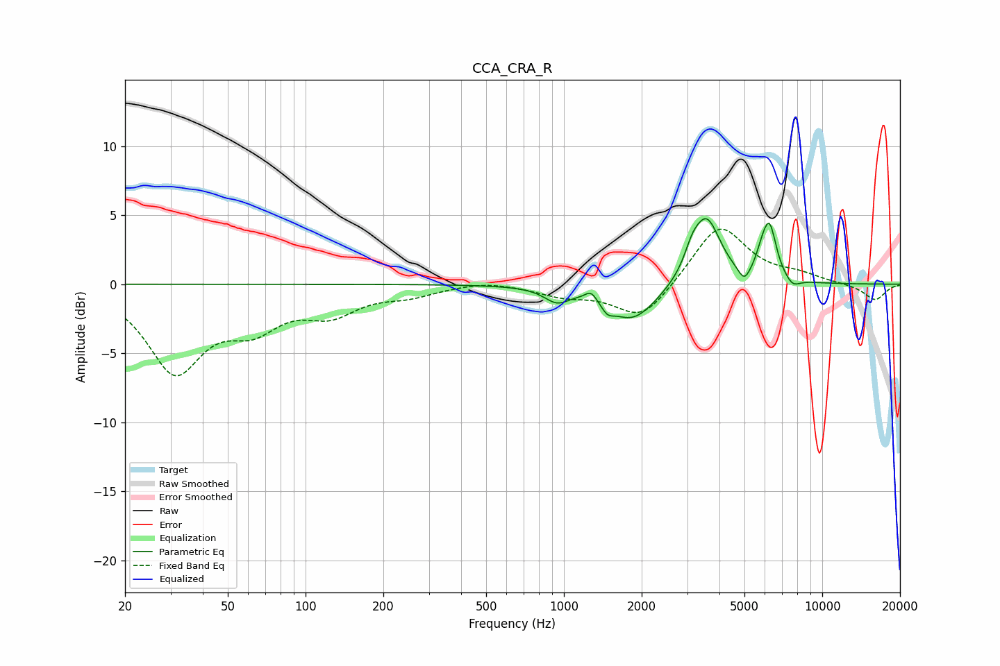

# CCA_CRA_R
See [usage instructions](https://github.com/jaakkopasanen/AutoEq#usage) for more options and info.

### Parametric EQs
Apply preamp of -4.8 dB when using parametric equalizer.

|   # | Type    |   Fc (Hz) |    Q |   Gain (dB) |
|-----|---------|-----------|------|-------------|
|   1 | Peaking |       938 | 2.97 |        -1   |
|   2 | Peaking |      1275 | 6    |         0.7 |
|   3 | Peaking |      1474 | 6    |        -0.6 |
|   4 | Peaking |      1844 | 1.48 |        -2.7 |
|   5 | Peaking |      3131 | 4.91 |         1.1 |
|   6 | Peaking |      3563 | 2.56 |         4.8 |
|   7 | Peaking |      4994 | 6    |        -1   |
|   8 | Peaking |      5823 | 6    |         0.9 |
|   9 | Peaking |      6246 | 5.04 |         3.8 |
|  10 | Peaking |      7679 | 4.85 |        -0.6 |

### Fixed Band EQs
When using fixed band (also called graphic) equalizer, apply preamp of **-4.1 dB** (if available) and set gains manually with these parameters.

|   # | Type    |   Fc (Hz) |    Q |   Gain (dB) |
|-----|---------|-----------|------|-------------|
|   1 | Peaking |        31 | 1.41 |        -6.1 |
|   2 | Peaking |        62 | 1.41 |        -2.5 |
|   3 | Peaking |       125 | 1.41 |        -1.8 |
|   4 | Peaking |       250 | 1.41 |        -0.7 |
|   5 | Peaking |       500 | 1.41 |         0.3 |
|   6 | Peaking |      1000 | 1.41 |        -0.7 |
|   7 | Peaking |      2000 | 1.41 |        -2.6 |
|   8 | Peaking |      4000 | 1.41 |         4.4 |
|   9 | Peaking |      8000 | 1.41 |         0.6 |
|  10 | Peaking |     16000 | 1.41 |        -1.2 |

### Graphs

