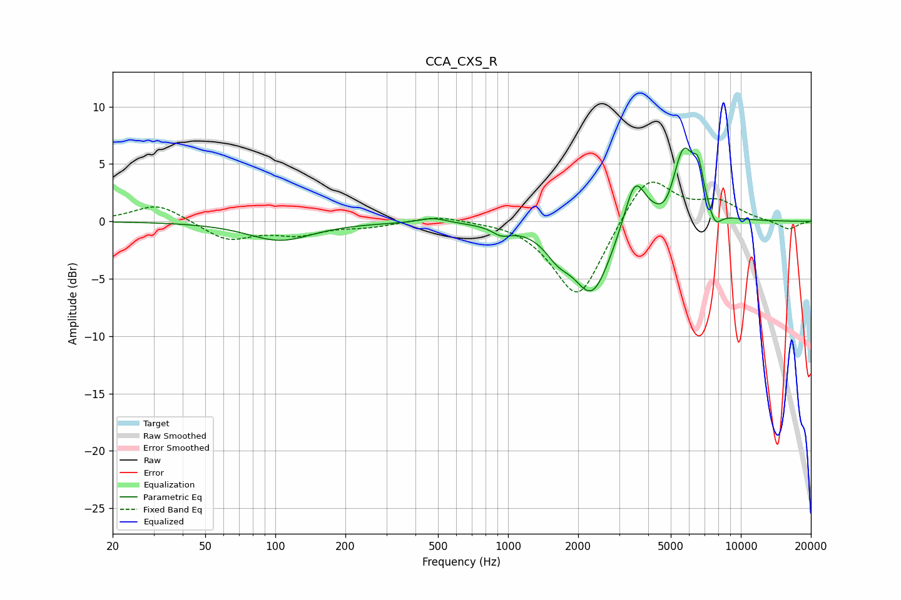

# CCA_CXS_R
See [usage instructions](https://github.com/jaakkopasanen/AutoEq#usage) for more options and info.

### Parametric EQs
Apply preamp of -6.5 dB when using parametric equalizer.

|   # | Type    |   Fc (Hz) |    Q |   Gain (dB) |
|-----|---------|-----------|------|-------------|
|   1 | Peaking |       105 | 1.02 |        -1.6 |
|   2 | Peaking |       476 | 2.47 |         0.5 |
|   3 | Peaking |       938 | 3.56 |        -0.7 |
|   4 | Peaking |      1637 | 2.56 |        -1.6 |
|   5 | Peaking |      2300 | 1.72 |        -6.3 |
|   6 | Peaking |      3505 | 3.04 |         4.5 |
|   7 | Peaking |      4811 | 3.18 |        -1.4 |
|   8 | Peaking |      5662 | 2.73 |         6.6 |
|   9 | Peaking |      6576 | 6    |         2.7 |
|  10 | Peaking |      7744 | 4.72 |        -1.5 |

### Fixed Band EQs
When using fixed band (also called graphic) equalizer, apply preamp of **-3.5 dB** (if available) and set gains manually with these parameters.

|   # | Type    |   Fc (Hz) |    Q |   Gain (dB) |
|-----|---------|-----------|------|-------------|
|   1 | Peaking |        31 | 1.41 |         1.6 |
|   2 | Peaking |        62 | 1.41 |        -1.6 |
|   3 | Peaking |       125 | 1.41 |        -1   |
|   4 | Peaking |       250 | 1.41 |        -0.4 |
|   5 | Peaking |       500 | 1.41 |         0.6 |
|   6 | Peaking |      1000 | 1.41 |         0.2 |
|   7 | Peaking |      2000 | 1.41 |        -7   |
|   8 | Peaking |      4000 | 1.41 |         4.4 |
|   9 | Peaking |      8000 | 1.41 |         1.5 |
|  10 | Peaking |     16000 | 1.41 |        -0.7 |

### Graphs

