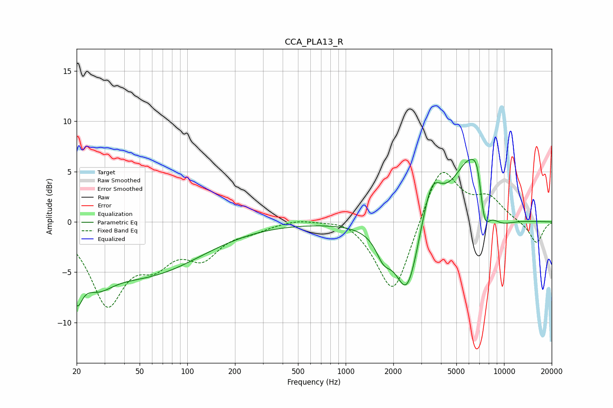

# CCA_PLA13_R
See [usage instructions](https://github.com/jaakkopasanen/AutoEq#usage) for more options and info.

### Parametric EQs
Apply preamp of -6.3 dB when using parametric equalizer.

|   # | Type    |   Fc (Hz) |    Q |   Gain (dB) |
|-----|---------|-----------|------|-------------|
|   1 | Peaking |        20 | 4.04 |        -3.9 |
|   2 | Peaking |        27 | 1.37 |        -2.8 |
|   3 | Peaking |        54 | 0.4  |        -5   |
|   4 | Peaking |      1735 | 2.95 |        -2.1 |
|   5 | Peaking |      2447 | 1.84 |        -7.6 |
|   6 | Peaking |      3475 | 2.21 |         4.6 |
|   7 | Peaking |      6035 | 1.31 |         6.2 |
|   8 | Peaking |      6826 | 3.86 |         3   |
|   9 | Peaking |      7478 | 3.8  |        -4.3 |
|  10 | Peaking |      9168 | 1.34 |        -1.5 |

### Fixed Band EQs
When using fixed band (also called graphic) equalizer, apply preamp of **-5.0 dB** (if available) and set gains manually with these parameters.

|   # | Type    |   Fc (Hz) |    Q |   Gain (dB) |
|-----|---------|-----------|------|-------------|
|   1 | Peaking |        31 | 1.41 |        -7.8 |
|   2 | Peaking |        62 | 1.41 |        -3.1 |
|   3 | Peaking |       125 | 1.41 |        -3   |
|   4 | Peaking |       250 | 1.41 |        -0.7 |
|   5 | Peaking |       500 | 1.41 |         0.4 |
|   6 | Peaking |      1000 | 1.41 |         0.6 |
|   7 | Peaking |      2000 | 1.41 |        -7.6 |
|   8 | Peaking |      4000 | 1.41 |         5.9 |
|   9 | Peaking |      8000 | 1.41 |         2.2 |
|  10 | Peaking |     16000 | 1.41 |        -2.2 |

### Graphs

