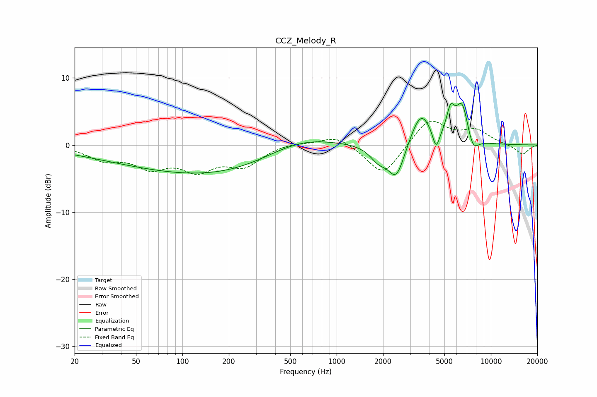

# CCZ_Melody_R
See [usage instructions](https://github.com/jaakkopasanen/AutoEq#usage) for more options and info.

### Parametric EQs
Apply preamp of -6.3 dB when using parametric equalizer.

|   # | Type    |   Fc (Hz) |    Q |   Gain (dB) |
|-----|---------|-----------|------|-------------|
|   1 | Peaking |        43 | 0.42 |        -1.6 |
|   2 | Peaking |       181 | 0.35 |        -4   |
|   3 | Peaking |       562 | 0.62 |         2.3 |
|   4 | Peaking |      1868 | 2.55 |        -2   |
|   5 | Peaking |      2442 | 2.58 |        -5.2 |
|   6 | Peaking |      3515 | 2.1  |         5.1 |
|   7 | Peaking |      4413 | 6    |        -3   |
|   8 | Peaking |      5480 | 5.25 |         3.6 |
|   9 | Peaking |      6512 | 3.22 |         5.9 |
|  10 | Peaking |      7626 | 3.61 |        -2.5 |

### Fixed Band EQs
When using fixed band (also called graphic) equalizer, apply preamp of **-3.7 dB** (if available) and set gains manually with these parameters.

|   # | Type    |   Fc (Hz) |    Q |   Gain (dB) |
|-----|---------|-----------|------|-------------|
|   1 | Peaking |        31 | 1.41 |        -1.9 |
|   2 | Peaking |        62 | 1.41 |        -2.9 |
|   3 | Peaking |       125 | 1.41 |        -3.3 |
|   4 | Peaking |       250 | 1.41 |        -2.9 |
|   5 | Peaking |       500 | 1.41 |         0.4 |
|   6 | Peaking |      1000 | 1.41 |         1.6 |
|   7 | Peaking |      2000 | 1.41 |        -4.7 |
|   8 | Peaking |      4000 | 1.41 |         4   |
|   9 | Peaking |      8000 | 1.41 |         2   |
|  10 | Peaking |     16000 | 1.41 |        -1.5 |

### Graphs

