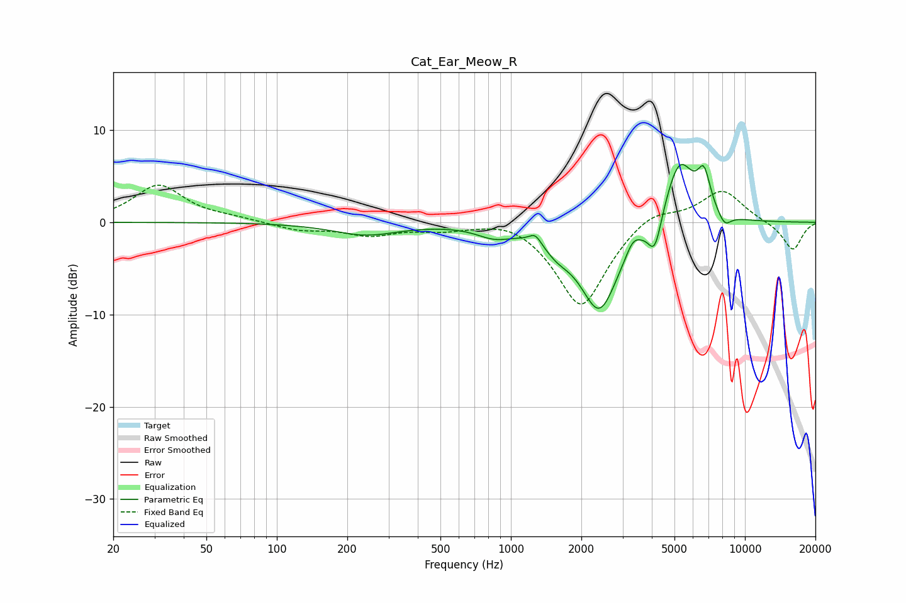

# Cat_Ear_Meow_R
See [usage instructions](https://github.com/jaakkopasanen/AutoEq#usage) for more options and info.

### Parametric EQs
Apply preamp of -6.4 dB when using parametric equalizer.

|   # | Type    |   Fc (Hz) |    Q |   Gain (dB) |
|-----|---------|-----------|------|-------------|
|   1 | Peaking |       239 | 1.01 |        -1.3 |
|   2 | Peaking |       847 | 1.9  |        -1.1 |
|   3 | Peaking |      1271 | 5.53 |         1.1 |
|   4 | Peaking |      1580 | 2.5  |        -1.3 |
|   5 | Peaking |      2390 | 1.64 |        -9.5 |
|   6 | Peaking |      3318 | 4.68 |         1.3 |
|   7 | Peaking |      4122 | 4.83 |        -3.8 |
|   8 | Peaking |      5248 | 2.13 |         7.3 |
|   9 | Peaking |      6685 | 4.97 |         3.9 |
|  10 | Peaking |      8179 | 4.71 |        -1.4 |

### Fixed Band EQs
When using fixed band (also called graphic) equalizer, apply preamp of **-4.1 dB** (if available) and set gains manually with these parameters.

|   # | Type    |   Fc (Hz) |    Q |   Gain (dB) |
|-----|---------|-----------|------|-------------|
|   1 | Peaking |        31 | 1.41 |         4   |
|   2 | Peaking |        62 | 1.41 |         0.3 |
|   3 | Peaking |       125 | 1.41 |        -0.8 |
|   4 | Peaking |       250 | 1.41 |        -1.3 |
|   5 | Peaking |       500 | 1.41 |        -0.7 |
|   6 | Peaking |      1000 | 1.41 |         0.8 |
|   7 | Peaking |      2000 | 1.41 |        -9.4 |
|   8 | Peaking |      4000 | 1.41 |         1.7 |
|   9 | Peaking |      8000 | 1.41 |         3.5 |
|  10 | Peaking |     16000 | 1.41 |        -3.1 |

### Graphs

