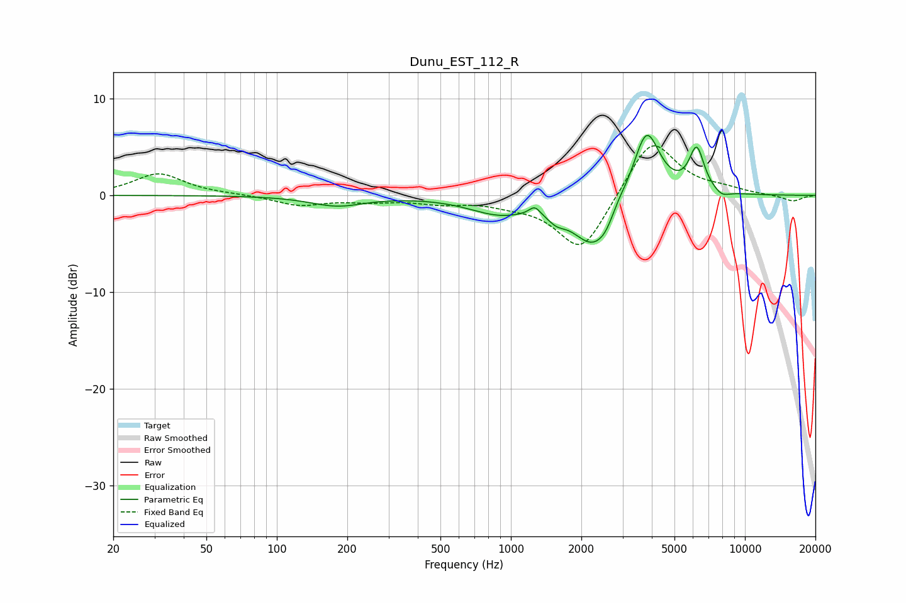

# Dunu_EST_112_R
See [usage instructions](https://github.com/jaakkopasanen/AutoEq#usage) for more options and info.

### Parametric EQs
Apply preamp of -6.3 dB when using parametric equalizer.

|   # | Type    |   Fc (Hz) |    Q |   Gain (dB) |
|-----|---------|-----------|------|-------------|
|   1 | Peaking |       181 | 1.24 |        -1   |
|   2 | Peaking |       888 | 1.09 |        -1.7 |
|   3 | Peaking |      1265 | 6    |         0.9 |
|   4 | Peaking |      1567 | 3.75 |        -0.9 |
|   5 | Peaking |      2240 | 1.59 |        -5.1 |
|   6 | Peaking |      2552 | 3.67 |        -0.9 |
|   7 | Peaking |      2856 | 4.44 |         0.6 |
|   8 | Peaking |      3794 | 2.43 |         7.3 |
|   9 | Peaking |      6221 | 4.28 |         4.5 |
|  10 | Peaking |      7967 | 4.05 |        -0.6 |

### Fixed Band EQs
When using fixed band (also called graphic) equalizer, apply preamp of **-5.2 dB** (if available) and set gains manually with these parameters.

|   # | Type    |   Fc (Hz) |    Q |   Gain (dB) |
|-----|---------|-----------|------|-------------|
|   1 | Peaking |        31 | 1.41 |         2.2 |
|   2 | Peaking |        62 | 1.41 |         0.1 |
|   3 | Peaking |       125 | 1.41 |        -1   |
|   4 | Peaking |       250 | 1.41 |        -0.5 |
|   5 | Peaking |       500 | 1.41 |        -0.7 |
|   6 | Peaking |      1000 | 1.41 |        -0.6 |
|   7 | Peaking |      2000 | 1.41 |        -6   |
|   8 | Peaking |      4000 | 1.41 |         6.1 |
|   9 | Peaking |      8000 | 1.41 |         0.5 |
|  10 | Peaking |     16000 | 1.41 |        -0.6 |

### Graphs

