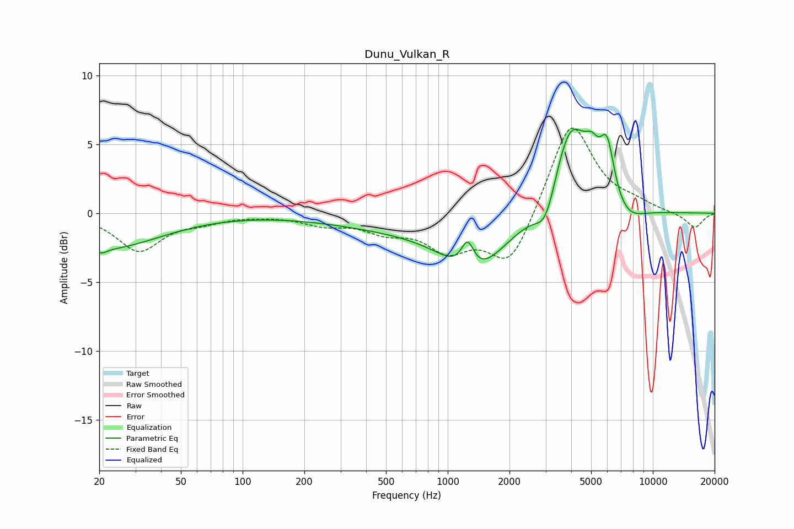

# Dunu_Vulkan_R
See [usage instructions](https://github.com/jaakkopasanen/AutoEq#usage) for more options and info.

### Parametric EQs
Apply preamp of -6.2 dB when using parametric equalizer.

|   # | Type    |   Fc (Hz) |    Q |   Gain (dB) |
|-----|---------|-----------|------|-------------|
|   1 | Peaking |        20 | 5.25 |        -0.4 |
|   2 | Peaking |        21 | 0.53 |        -2.5 |
|   3 | Peaking |       919 | 0.3  |        -1.2 |
|   4 | Peaking |      1250 | 4.43 |         2.2 |
|   5 | Peaking |      1330 | 1.04 |        -3.4 |
|   6 | Peaking |      3007 | 2.8  |        -2.5 |
|   7 | Peaking |      3971 | 1.56 |         7   |
|   8 | Peaking |      5034 | 4.02 |         1.6 |
|   9 | Peaking |      5982 | 3.87 |         4   |
|  10 | Peaking |      7411 | 1.7  |        -1.2 |

### Fixed Band EQs
When using fixed band (also called graphic) equalizer, apply preamp of **-6.3 dB** (if available) and set gains manually with these parameters.

|   # | Type    |   Fc (Hz) |    Q |   Gain (dB) |
|-----|---------|-----------|------|-------------|
|   1 | Peaking |        31 | 1.41 |        -2.7 |
|   2 | Peaking |        62 | 1.41 |        -0.5 |
|   3 | Peaking |       125 | 1.41 |        -0.1 |
|   4 | Peaking |       250 | 1.41 |        -0.7 |
|   5 | Peaking |       500 | 1.41 |        -1.1 |
|   6 | Peaking |      1000 | 1.41 |        -2.4 |
|   7 | Peaking |      2000 | 1.41 |        -3.9 |
|   8 | Peaking |      4000 | 1.41 |         6.9 |
|   9 | Peaking |      8000 | 1.41 |         0.5 |
|  10 | Peaking |     16000 | 1.41 |        -1.1 |

### Graphs

