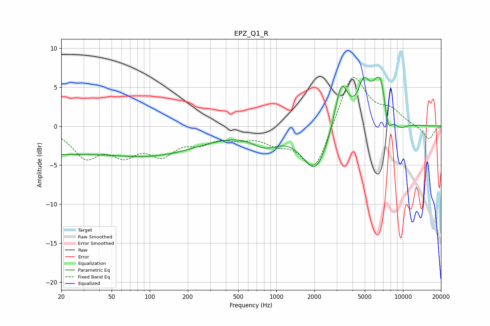

# EPZ_Q1_R
See [usage instructions](https://github.com/jaakkopasanen/AutoEq#usage) for more options and info.

### Parametric EQs
Apply preamp of -6.4 dB when using parametric equalizer.

|   # | Type    |   Fc (Hz) |    Q |   Gain (dB) |
|-----|---------|-----------|------|-------------|
|   1 | Peaking |        20 | 0.34 |        -3.6 |
|   2 | Peaking |        31 | 0.66 |         0.6 |
|   3 | Peaking |       125 | 0.41 |        -3   |
|   4 | Peaking |       814 | 1.34 |        -1.8 |
|   5 | Peaking |      2041 | 1.39 |        -5.9 |
|   6 | Peaking |      3265 | 2.67 |         6.2 |
|   7 | Peaking |      4901 | 3.08 |         3.9 |
|   8 | Peaking |      6729 | 2.03 |         7.4 |
|   9 | Peaking |      7589 | 4.04 |        -4.5 |
|  10 | Peaking |      9275 | 2.04 |        -1.4 |

### Fixed Band EQs
When using fixed band (also called graphic) equalizer, apply preamp of **-6.4 dB** (if available) and set gains manually with these parameters.

|   # | Type    |   Fc (Hz) |    Q |   Gain (dB) |
|-----|---------|-----------|------|-------------|
|   1 | Peaking |        31 | 1.41 |        -3.6 |
|   2 | Peaking |        62 | 1.41 |        -3   |
|   3 | Peaking |       125 | 1.41 |        -3.1 |
|   4 | Peaking |       250 | 1.41 |        -1.6 |
|   5 | Peaking |       500 | 1.41 |        -1.1 |
|   6 | Peaking |      1000 | 1.41 |        -1.7 |
|   7 | Peaking |      2000 | 1.41 |        -5.9 |
|   8 | Peaking |      4000 | 1.41 |         7.1 |
|   9 | Peaking |      8000 | 1.41 |         1.7 |
|  10 | Peaking |     16000 | 1.41 |        -1.7 |

### Graphs

