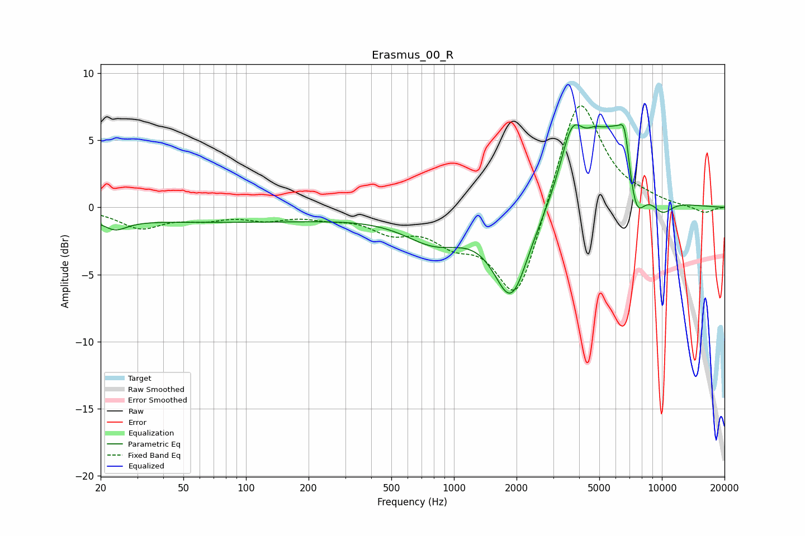

# Erasmus_00_R
See [usage instructions](https://github.com/jaakkopasanen/AutoEq#usage) for more options and info.

### Parametric EQs
Apply preamp of -6.3 dB when using parametric equalizer.

|   # | Type    |   Fc (Hz) |    Q |   Gain (dB) |
|-----|---------|-----------|------|-------------|
|   1 | Peaking |        23 | 2.49 |        -0.8 |
|   2 | Peaking |        70 | 0.18 |        -1.1 |
|   3 | Peaking |       812 | 0.94 |        -2.2 |
|   4 | Peaking |      1886 | 1.68 |        -6.5 |
|   5 | Peaking |      3701 | 2.33 |         5   |
|   6 | Peaking |      4745 | 3.13 |         1.2 |
|   7 | Peaking |      6159 | 1.32 |         6.1 |
|   8 | Peaking |      6619 | 6    |         2.3 |
|   9 | Peaking |      7465 | 2.9  |        -4.5 |
|  10 | Peaking |     10000 | 2.34 |        -1.3 |

### Fixed Band EQs
When using fixed band (also called graphic) equalizer, apply preamp of **-7.7 dB** (if available) and set gains manually with these parameters.

|   # | Type    |   Fc (Hz) |    Q |   Gain (dB) |
|-----|---------|-----------|------|-------------|
|   1 | Peaking |        31 | 1.41 |        -1.5 |
|   2 | Peaking |        62 | 1.41 |        -0.7 |
|   3 | Peaking |       125 | 1.41 |        -0.7 |
|   4 | Peaking |       250 | 1.41 |        -0.5 |
|   5 | Peaking |       500 | 1.41 |        -1.5 |
|   6 | Peaking |      1000 | 1.41 |        -2   |
|   7 | Peaking |      2000 | 1.41 |        -7.3 |
|   8 | Peaking |      4000 | 1.41 |         8.9 |
|   9 | Peaking |      8000 | 1.41 |         0.4 |
|  10 | Peaking |     16000 | 1.41 |        -0.5 |

### Graphs

