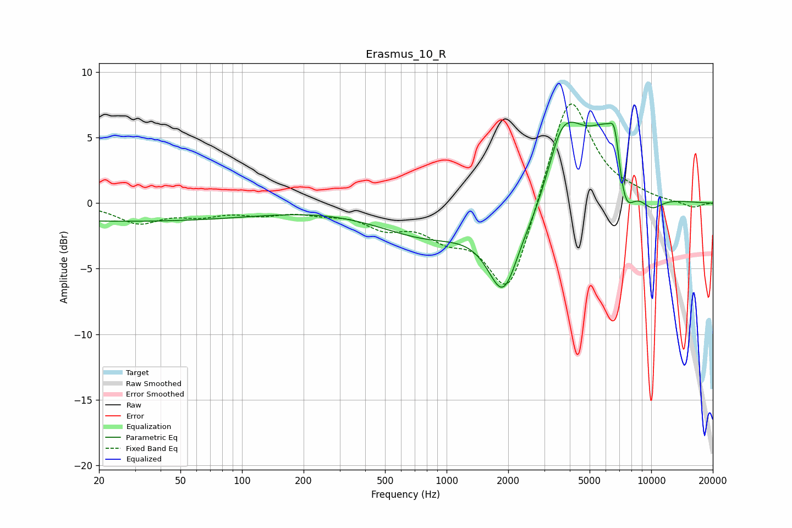

# Erasmus_10_R
See [usage instructions](https://github.com/jaakkopasanen/AutoEq#usage) for more options and info.

### Parametric EQs
Apply preamp of -6.3 dB when using parametric equalizer.

|   # | Type    |   Fc (Hz) |    Q |   Gain (dB) |
|-----|---------|-----------|------|-------------|
|   1 | Peaking |        26 | 0.18 |        -1.4 |
|   2 | Peaking |       818 | 0.57 |        -2.4 |
|   3 | Peaking |      1896 | 1.81 |        -6.2 |
|   4 | Peaking |      2712 | 2.15 |        -0.8 |
|   5 | Peaking |      3581 | 3.03 |         1.1 |
|   6 | Peaking |      3889 | 1.39 |         5   |
|   7 | Peaking |      6263 | 1.39 |         5.7 |
|   8 | Peaking |      6641 | 5.75 |         2.5 |
|   9 | Peaking |      7391 | 2.68 |        -4.8 |
|  10 | Peaking |     10000 | 2.11 |        -1.3 |

### Fixed Band EQs
When using fixed band (also called graphic) equalizer, apply preamp of **-7.7 dB** (if available) and set gains manually with these parameters.

|   # | Type    |   Fc (Hz) |    Q |   Gain (dB) |
|-----|---------|-----------|------|-------------|
|   1 | Peaking |        31 | 1.41 |        -1.4 |
|   2 | Peaking |        62 | 1.41 |        -0.8 |
|   3 | Peaking |       125 | 1.41 |        -0.7 |
|   4 | Peaking |       250 | 1.41 |        -0.5 |
|   5 | Peaking |       500 | 1.41 |        -1.5 |
|   6 | Peaking |      1000 | 1.41 |        -1.9 |
|   7 | Peaking |      2000 | 1.41 |        -7.4 |
|   8 | Peaking |      4000 | 1.41 |         8.9 |
|   9 | Peaking |      8000 | 1.41 |         0.4 |
|  10 | Peaking |     16000 | 1.41 |        -0.4 |

### Graphs

