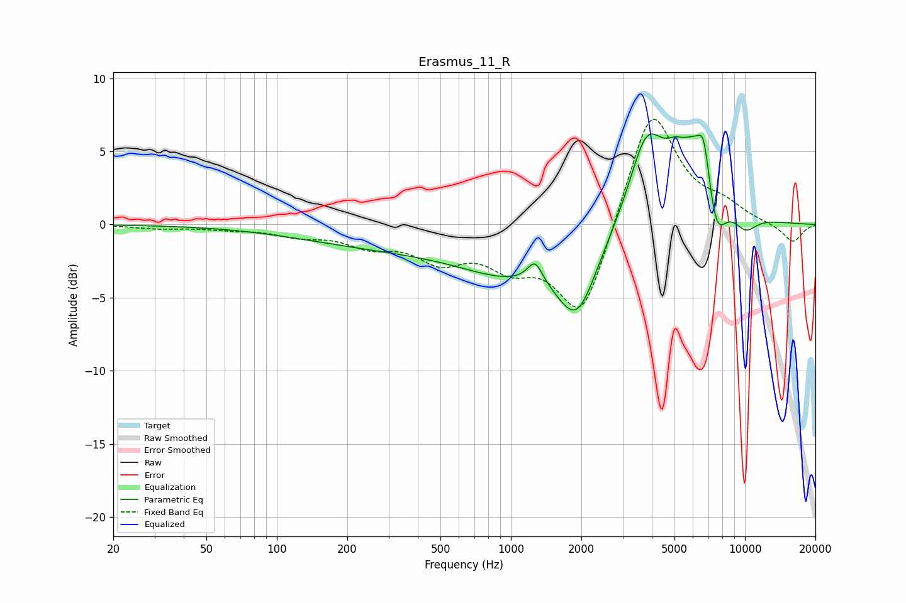

# Erasmus_11_R
See [usage instructions](https://github.com/jaakkopasanen/AutoEq#usage) for more options and info.

### Parametric EQs
Apply preamp of -6.3 dB when using parametric equalizer.

|   # | Type    |   Fc (Hz) |    Q |   Gain (dB) |
|-----|---------|-----------|------|-------------|
|   1 | Peaking |       332 | 0.34 |        -1.4 |
|   2 | Peaking |       994 | 0.67 |        -2.3 |
|   3 | Peaking |      1266 | 4.43 |         1.5 |
|   4 | Peaking |      1916 | 1.61 |        -5.2 |
|   5 | Peaking |      3799 | 1.87 |         5.6 |
|   6 | Peaking |      4998 | 3.54 |         0.8 |
|   7 | Peaking |      6391 | 1.42 |         6.1 |
|   8 | Peaking |      6679 | 6    |         2.1 |
|   9 | Peaking |      7509 | 2.87 |        -4.7 |
|  10 | Peaking |     10000 | 2.32 |        -1.3 |

### Fixed Band EQs
When using fixed band (also called graphic) equalizer, apply preamp of **-7.3 dB** (if available) and set gains manually with these parameters.

|   # | Type    |   Fc (Hz) |    Q |   Gain (dB) |
|-----|---------|-----------|------|-------------|
|   1 | Peaking |        31 | 1.41 |        -0.2 |
|   2 | Peaking |        62 | 1.41 |        -0.2 |
|   3 | Peaking |       125 | 1.41 |        -0.6 |
|   4 | Peaking |       250 | 1.41 |        -1.2 |
|   5 | Peaking |       500 | 1.41 |        -2.1 |
|   6 | Peaking |      1000 | 1.41 |        -2.3 |
|   7 | Peaking |      2000 | 1.41 |        -6.6 |
|   8 | Peaking |      4000 | 1.41 |         8.3 |
|   9 | Peaking |      8000 | 1.41 |         1   |
|  10 | Peaking |     16000 | 1.41 |        -1.3 |

### Graphs

