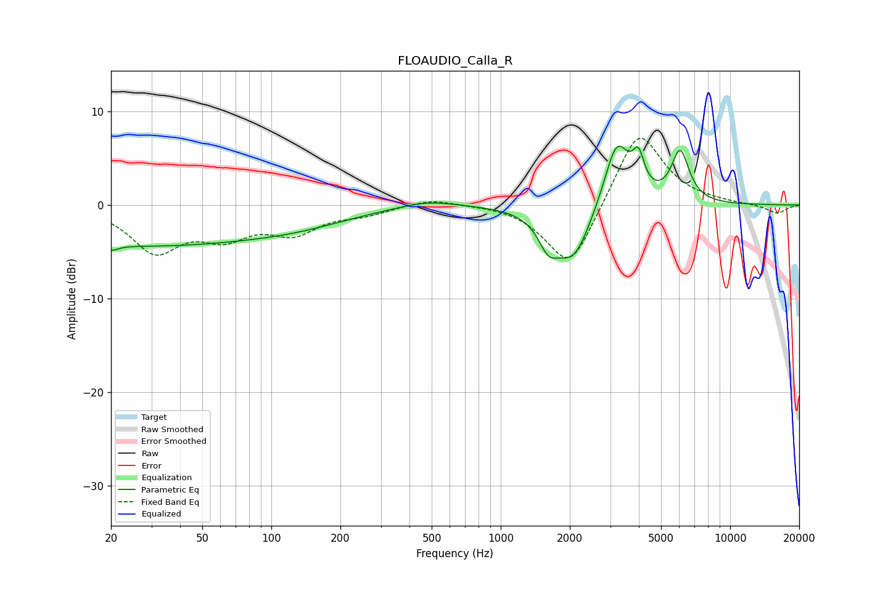

# FLOAUDIO_Calla_R
See [usage instructions](https://github.com/jaakkopasanen/AutoEq#usage) for more options and info.

### Parametric EQs
Apply preamp of -6.4 dB when using parametric equalizer.

|   # | Type    |   Fc (Hz) |    Q |   Gain (dB) |
|-----|---------|-----------|------|-------------|
|   1 | Peaking |        20 | 5.91 |         3.2 |
|   2 | Peaking |        20 | 5.79 |        -3.8 |
|   3 | Peaking |        26 | 0.22 |        -4.3 |
|   4 | Peaking |       138 | 0.62 |        -0.9 |
|   5 | Peaking |       478 | 1.11 |         0.7 |
|   6 | Peaking |      1612 | 3.33 |        -2.7 |
|   7 | Peaking |      2069 | 1.76 |        -6   |
|   8 | Peaking |      3206 | 2.46 |         7.3 |
|   9 | Peaking |      3986 | 5.74 |         3.3 |
|  10 | Peaking |      6058 | 3.58 |         5.4 |

### Fixed Band EQs
When using fixed band (also called graphic) equalizer, apply preamp of **-7.2 dB** (if available) and set gains manually with these parameters.

|   # | Type    |   Fc (Hz) |    Q |   Gain (dB) |
|-----|---------|-----------|------|-------------|
|   1 | Peaking |        31 | 1.41 |        -4.7 |
|   2 | Peaking |        62 | 1.41 |        -2.9 |
|   3 | Peaking |       125 | 1.41 |        -2.7 |
|   4 | Peaking |       250 | 1.41 |        -0.8 |
|   5 | Peaking |       500 | 1.41 |         0.8 |
|   6 | Peaking |      1000 | 1.41 |         0.1 |
|   7 | Peaking |      2000 | 1.41 |        -7.2 |
|   8 | Peaking |      4000 | 1.41 |         8.4 |
|   9 | Peaking |      8000 | 1.41 |         0.1 |
|  10 | Peaking |     16000 | 1.41 |        -0.9 |

### Graphs

