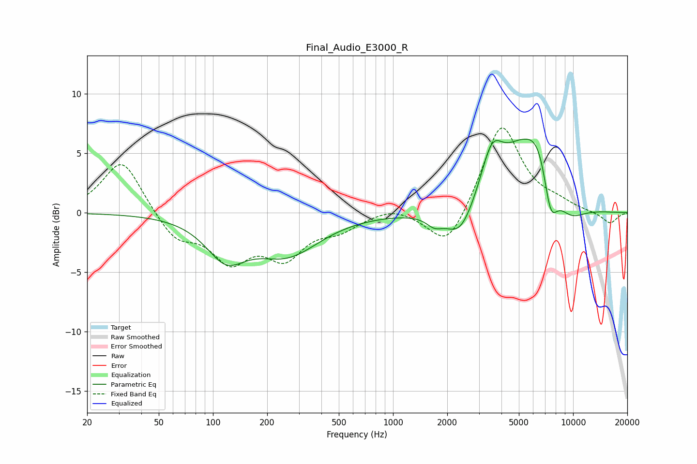

# Final_Audio_E3000_R
See [usage instructions](https://github.com/jaakkopasanen/AutoEq#usage) for more options and info.

### Parametric EQs
Apply preamp of -6.3 dB when using parametric equalizer.

|   # | Type    |   Fc (Hz) |    Q |   Gain (dB) |
|-----|---------|-----------|------|-------------|
|   1 | Peaking |       118 | 1.29 |        -3.2 |
|   2 | Peaking |       258 | 0.77 |        -3.3 |
|   3 | Peaking |      1699 | 3.13 |        -0.8 |
|   4 | Peaking |      2359 | 1.8  |        -2.6 |
|   5 | Peaking |      3542 | 2.2  |         4.2 |
|   6 | Peaking |      4630 | 1.15 |         1.4 |
|   7 | Peaking |      4902 | 1.81 |         1.1 |
|   8 | Peaking |      6515 | 1.39 |         6   |
|   9 | Peaking |      7478 | 3.19 |        -4.4 |
|  10 | Peaking |      9455 | 1.44 |        -1.8 |

### Fixed Band EQs
When using fixed band (also called graphic) equalizer, apply preamp of **-7.2 dB** (if available) and set gains manually with these parameters.

|   # | Type    |   Fc (Hz) |    Q |   Gain (dB) |
|-----|---------|-----------|------|-------------|
|   1 | Peaking |        31 | 1.41 |         4.6 |
|   2 | Peaking |        62 | 1.41 |        -2.2 |
|   3 | Peaking |       125 | 1.41 |        -3.7 |
|   4 | Peaking |       250 | 1.41 |        -3.3 |
|   5 | Peaking |       500 | 1.41 |        -1.2 |
|   6 | Peaking |      1000 | 1.41 |         0.6 |
|   7 | Peaking |      2000 | 1.41 |        -3.3 |
|   8 | Peaking |      4000 | 1.41 |         7.6 |
|   9 | Peaking |      8000 | 1.41 |         0.6 |
|  10 | Peaking |     16000 | 1.41 |        -0.9 |

### Graphs

