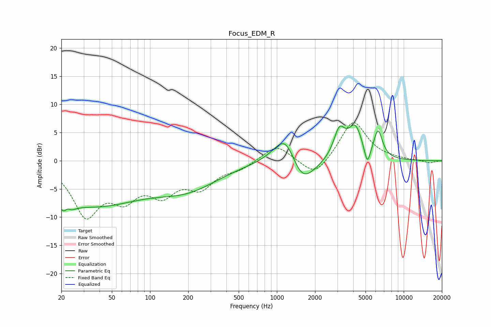

# Focus_EDM_R
See [usage instructions](https://github.com/jaakkopasanen/AutoEq#usage) for more options and info.

### Parametric EQs
Apply preamp of -6.4 dB when using parametric equalizer.

|   # | Type    |   Fc (Hz) |    Q |   Gain (dB) |
|-----|---------|-----------|------|-------------|
|   1 | Peaking |        22 | 3.53 |        -5.1 |
|   2 | Peaking |        22 | 5.08 |         3.4 |
|   3 | Peaking |        35 | 0.34 |        -7.6 |
|   4 | Peaking |       201 | 0.57 |        -4.1 |
|   5 | Peaking |      1178 | 1.5  |         6.6 |
|   6 | Peaking |      1559 | 1.39 |        -5.9 |
|   7 | Peaking |      3110 | 3.11 |         4.9 |
|   8 | Peaking |      4145 | 2.51 |         5.5 |
|   9 | Peaking |      5166 | 5.78 |        -3.4 |
|  10 | Peaking |      6283 | 4.03 |         4.8 |

### Fixed Band EQs
When using fixed band (also called graphic) equalizer, apply preamp of **-6.8 dB** (if available) and set gains manually with these parameters.

|   # | Type    |   Fc (Hz) |    Q |   Gain (dB) |
|-----|---------|-----------|------|-------------|
|   1 | Peaking |        31 | 1.41 |        -9.1 |
|   2 | Peaking |        62 | 1.41 |        -5.3 |
|   3 | Peaking |       125 | 1.41 |        -4.9 |
|   4 | Peaking |       250 | 1.41 |        -4.2 |
|   5 | Peaking |       500 | 1.41 |        -1.2 |
|   6 | Peaking |      1000 | 1.41 |         2.9 |
|   7 | Peaking |      2000 | 1.41 |        -3.2 |
|   8 | Peaking |      4000 | 1.41 |         7.2 |
|   9 | Peaking |      8000 | 1.41 |         0.2 |
|  10 | Peaking |     16000 | 1.41 |        -0.4 |

### Graphs

