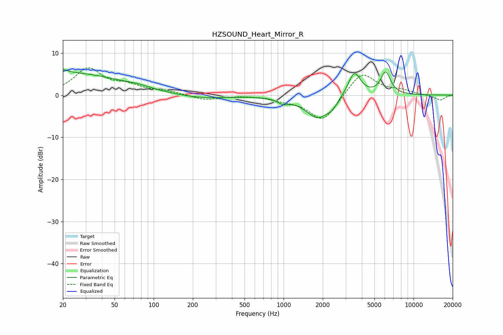

# HZSOUND_Heart_Mirror_R
See [usage instructions](https://github.com/jaakkopasanen/AutoEq#usage) for more options and info.

### Parametric EQs
Apply preamp of -6.2 dB when using parametric equalizer.

|   # | Type    |   Fc (Hz) |    Q |   Gain (dB) |
|-----|---------|-----------|------|-------------|
|   1 | Peaking |        20 | 5.24 |         3.7 |
|   2 | Peaking |        20 | 5.98 |        -2.7 |
|   3 | Peaking |        23 | 0.37 |         5.2 |
|   4 | Peaking |        75 | 1.39 |         0.5 |
|   5 | Peaking |       237 | 0.73 |        -0.9 |
|   6 | Peaking |       986 | 3.47 |        -1.1 |
|   7 | Peaking |      1853 | 1.45 |        -5.5 |
|   8 | Peaking |      2383 | 4.56 |        -1   |
|   9 | Peaking |      3495 | 2.86 |         6   |
|  10 | Peaking |      6097 | 3.63 |         5.4 |

### Fixed Band EQs
When using fixed band (also called graphic) equalizer, apply preamp of **-6.6 dB** (if available) and set gains manually with these parameters.

|   # | Type    |   Fc (Hz) |    Q |   Gain (dB) |
|-----|---------|-----------|------|-------------|
|   1 | Peaking |        31 | 1.41 |         6.1 |
|   2 | Peaking |        62 | 1.41 |         1.9 |
|   3 | Peaking |       125 | 1.41 |         0.8 |
|   4 | Peaking |       250 | 1.41 |        -1.2 |
|   5 | Peaking |       500 | 1.41 |         0.1 |
|   6 | Peaking |      1000 | 1.41 |        -0.8 |
|   7 | Peaking |      2000 | 1.41 |        -6.3 |
|   8 | Peaking |      4000 | 1.41 |         5.7 |
|   9 | Peaking |      8000 | 1.41 |         0.9 |
|  10 | Peaking |     16000 | 1.41 |        -1.2 |

### Graphs

