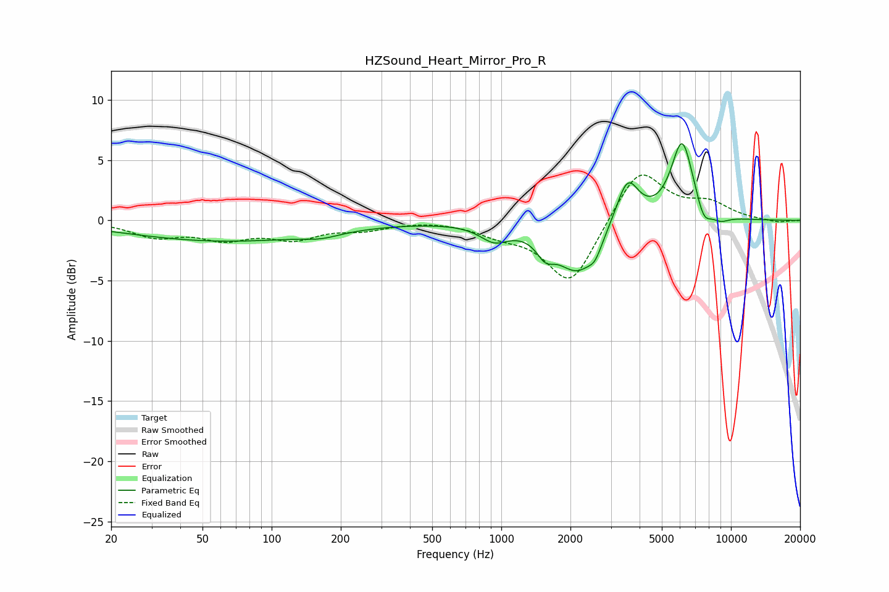

# HZSound_Heart_Mirror_Pro_R
See [usage instructions](https://github.com/jaakkopasanen/AutoEq#usage) for more options and info.

### Parametric EQs
Apply preamp of -6.5 dB when using parametric equalizer.

|   # | Type    |   Fc (Hz) |    Q |   Gain (dB) |
|-----|---------|-----------|------|-------------|
|   1 | Peaking |        62 | 0.33 |        -1.7 |
|   2 | Peaking |       164 | 1.81 |        -0.4 |
|   3 | Peaking |       932 | 2.3  |        -1.3 |
|   4 | Peaking |      1554 | 3.77 |        -1.4 |
|   5 | Peaking |      2154 | 1.5  |        -4.2 |
|   6 | Peaking |      2564 | 5.09 |        -0.9 |
|   7 | Peaking |      3539 | 2.82 |         3.9 |
|   8 | Peaking |      6132 | 2.79 |         6.7 |
|   9 | Peaking |      7607 | 4.24 |        -1.5 |
|  10 | Peaking |      8994 | 3.25 |        -0.6 |

### Fixed Band EQs
When using fixed band (also called graphic) equalizer, apply preamp of **-3.9 dB** (if available) and set gains manually with these parameters.

|   # | Type    |   Fc (Hz) |    Q |   Gain (dB) |
|-----|---------|-----------|------|-------------|
|   1 | Peaking |        31 | 1.41 |        -1.2 |
|   2 | Peaking |        62 | 1.41 |        -1.3 |
|   3 | Peaking |       125 | 1.41 |        -1.3 |
|   4 | Peaking |       250 | 1.41 |        -0.6 |
|   5 | Peaking |       500 | 1.41 |         0.1 |
|   6 | Peaking |      1000 | 1.41 |        -0.9 |
|   7 | Peaking |      2000 | 1.41 |        -5.4 |
|   8 | Peaking |      4000 | 1.41 |         4.5 |
|   9 | Peaking |      8000 | 1.41 |         1.3 |
|  10 | Peaking |     16000 | 1.41 |        -0.2 |

### Graphs

