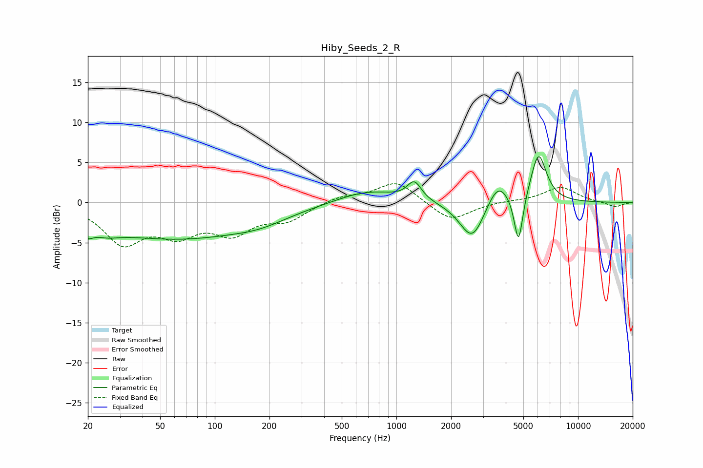

# Hiby_Seeds_2_R
See [usage instructions](https://github.com/jaakkopasanen/AutoEq#usage) for more options and info.

### Parametric EQs
Apply preamp of -5.8 dB when using parametric equalizer.

|   # | Type    |   Fc (Hz) |    Q |   Gain (dB) |
|-----|---------|-----------|------|-------------|
|   1 | Peaking |        21 | 1.76 |        -4.1 |
|   2 | Peaking |        22 | 2.73 |         2.2 |
|   3 | Peaking |        62 | 0.34 |        -4.3 |
|   4 | Peaking |       179 | 0.94 |        -0.9 |
|   5 | Peaking |       697 | 0.85 |         1.6 |
|   6 | Peaking |      1255 | 3.64 |         2.3 |
|   7 | Peaking |      2621 | 2.02 |        -5   |
|   8 | Peaking |      3612 | 2.26 |         3.2 |
|   9 | Peaking |      4703 | 5.79 |        -6.4 |
|  10 | Peaking |      6059 | 3.15 |         6.2 |

### Fixed Band EQs
When using fixed band (also called graphic) equalizer, apply preamp of **-2.4 dB** (if available) and set gains manually with these parameters.

|   # | Type    |   Fc (Hz) |    Q |   Gain (dB) |
|-----|---------|-----------|------|-------------|
|   1 | Peaking |        31 | 1.41 |        -4.8 |
|   2 | Peaking |        62 | 1.41 |        -3.3 |
|   3 | Peaking |       125 | 1.41 |        -3.4 |
|   4 | Peaking |       250 | 1.41 |        -1.9 |
|   5 | Peaking |       500 | 1.41 |         0.8 |
|   6 | Peaking |      1000 | 1.41 |         2.7 |
|   7 | Peaking |      2000 | 1.41 |        -2.4 |
|   8 | Peaking |      4000 | 1.41 |         0.2 |
|   9 | Peaking |      8000 | 1.41 |         1.9 |
|  10 | Peaking |     16000 | 1.41 |        -0.6 |

### Graphs

