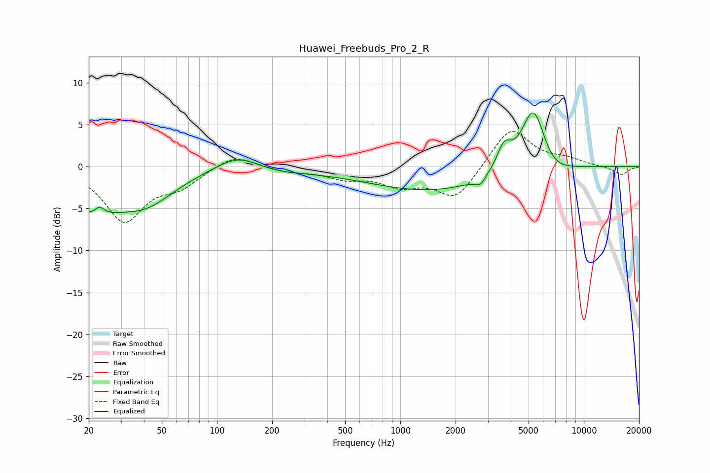

# Huawei_Freebuds_Pro_2_R
See [usage instructions](https://github.com/jaakkopasanen/AutoEq#usage) for more options and info.

### Parametric EQs
Apply preamp of -6.5 dB when using parametric equalizer.

|   # | Type    |   Fc (Hz) |    Q |   Gain (dB) |
|-----|---------|-----------|------|-------------|
|   1 | Peaking |        20 | 0.87 |        -4.5 |
|   2 | Peaking |        23 | 5.57 |         1   |
|   3 | Peaking |        41 | 0.89 |        -3.5 |
|   4 | Peaking |       130 | 1.2  |         1.9 |
|   5 | Peaking |       206 | 0.8  |        -0.6 |
|   6 | Peaking |      1506 | 0.39 |        -2.9 |
|   7 | Peaking |      2733 | 5    |        -1   |
|   8 | Peaking |      3668 | 3.6  |         2.8 |
|   9 | Peaking |      5313 | 2.02 |         8.1 |
|  10 | Peaking |      6692 | 1.57 |        -1.7 |

### Fixed Band EQs
When using fixed band (also called graphic) equalizer, apply preamp of **-4.3 dB** (if available) and set gains manually with these parameters.

|   # | Type    |   Fc (Hz) |    Q |   Gain (dB) |
|-----|---------|-----------|------|-------------|
|   1 | Peaking |        31 | 1.41 |        -6.3 |
|   2 | Peaking |        62 | 1.41 |        -2   |
|   3 | Peaking |       125 | 1.41 |         1.6 |
|   4 | Peaking |       250 | 1.41 |        -0.6 |
|   5 | Peaking |       500 | 1.41 |        -1.2 |
|   6 | Peaking |      1000 | 1.41 |        -2   |
|   7 | Peaking |      2000 | 1.41 |        -3.8 |
|   8 | Peaking |      4000 | 1.41 |         4.8 |
|   9 | Peaking |      8000 | 1.41 |         0.7 |
|  10 | Peaking |     16000 | 1.41 |        -1   |

### Graphs

