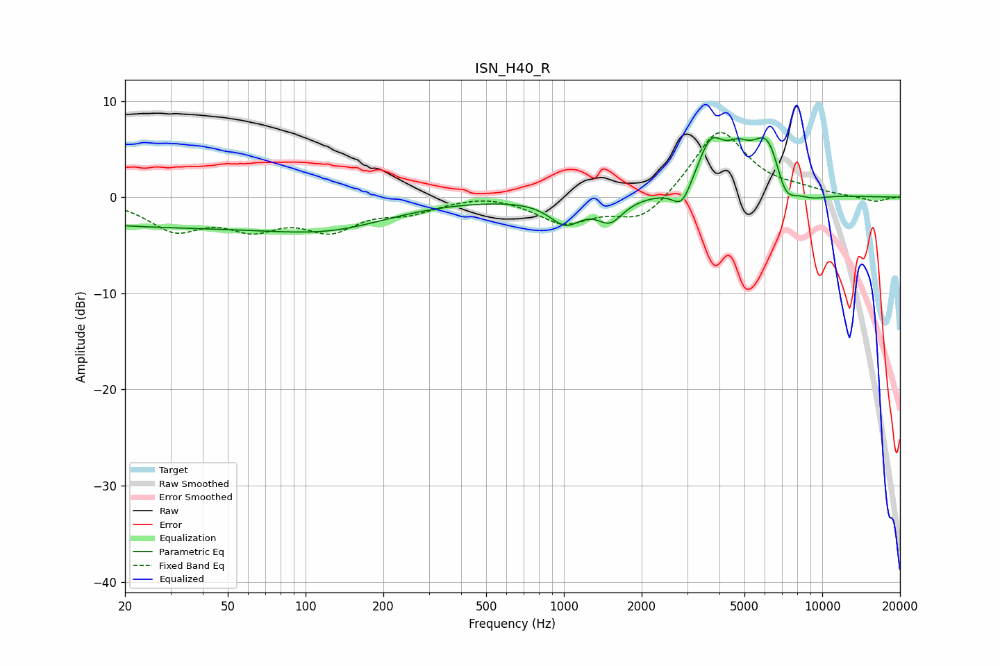

# ISN_H40_R
See [usage instructions](https://github.com/jaakkopasanen/AutoEq#usage) for more options and info.

### Parametric EQs
Apply preamp of -6.3 dB when using parametric equalizer.

|   # | Type    |   Fc (Hz) |    Q |   Gain (dB) |
|-----|---------|-----------|------|-------------|
|   1 | Peaking |        27 | 0.23 |        -2.9 |
|   2 | Peaking |       131 | 0.61 |        -2   |
|   3 | Peaking |      1014 | 2.28 |        -2.5 |
|   4 | Peaking |      1510 | 2.83 |        -2.3 |
|   5 | Peaking |      2864 | 3.88 |        -2.3 |
|   6 | Peaking |      3703 | 2.63 |         5   |
|   7 | Peaking |      4713 | 2.97 |         2.3 |
|   8 | Peaking |      6199 | 2.02 |         6.8 |
|   9 | Peaking |      7141 | 3.04 |        -3.7 |
|  10 | Peaking |      8964 | 1.84 |        -0.9 |

### Fixed Band EQs
When using fixed band (also called graphic) equalizer, apply preamp of **-6.8 dB** (if available) and set gains manually with these parameters.

|   # | Type    |   Fc (Hz) |    Q |   Gain (dB) |
|-----|---------|-----------|------|-------------|
|   1 | Peaking |        31 | 1.41 |        -3.1 |
|   2 | Peaking |        62 | 1.41 |        -2.7 |
|   3 | Peaking |       125 | 1.41 |        -3   |
|   4 | Peaking |       250 | 1.41 |        -1.3 |
|   5 | Peaking |       500 | 1.41 |         0.5 |
|   6 | Peaking |      1000 | 1.41 |        -2.6 |
|   7 | Peaking |      2000 | 1.41 |        -2.7 |
|   8 | Peaking |      4000 | 1.41 |         7.2 |
|   9 | Peaking |      8000 | 1.41 |         0.5 |
|  10 | Peaking |     16000 | 1.41 |        -0.5 |

### Graphs

