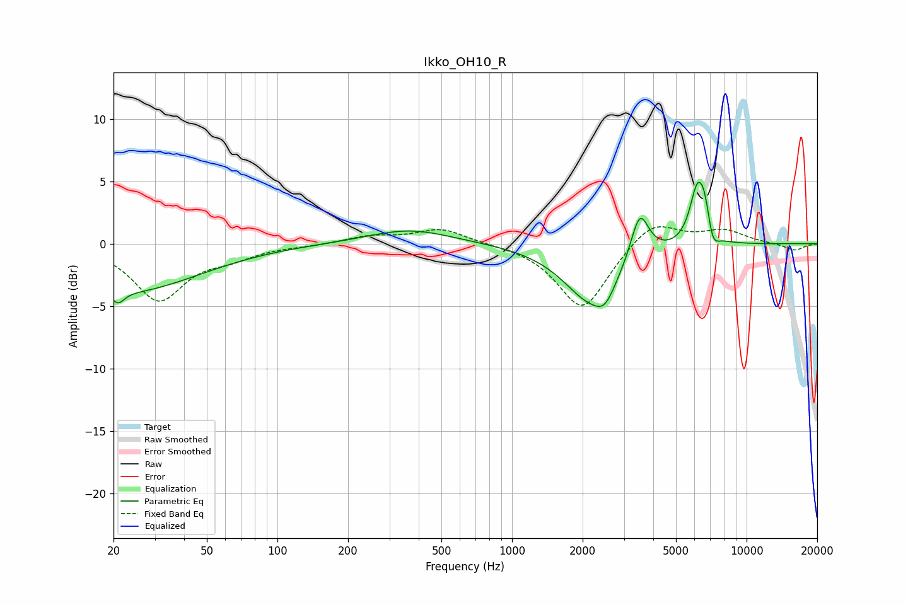

# Ikko_OH10_R
See [usage instructions](https://github.com/jaakkopasanen/AutoEq#usage) for more options and info.

### Parametric EQs
Apply preamp of -5.0 dB when using parametric equalizer.

|   # | Type    |   Fc (Hz) |    Q |   Gain (dB) |
|-----|---------|-----------|------|-------------|
|   1 | Peaking |        21 | 5.33 |        -1   |
|   2 | Peaking |        23 | 0.46 |        -3.8 |
|   3 | Peaking |       366 | 0.79 |         1.2 |
|   4 | Peaking |      2034 | 2.52 |        -0.1 |
|   5 | Peaking |      2168 | 1.15 |        -4.2 |
|   6 | Peaking |      2488 | 3.23 |        -1.5 |
|   7 | Peaking |      3503 | 3.64 |         3.8 |
|   8 | Peaking |      6162 | 4.24 |         4.4 |
|   9 | Peaking |      6630 | 6    |         2.1 |
|  10 | Peaking |      7166 | 5.71 |        -1.4 |

### Fixed Band EQs
When using fixed band (also called graphic) equalizer, apply preamp of **-1.5 dB** (if available) and set gains manually with these parameters.

|   # | Type    |   Fc (Hz) |    Q |   Gain (dB) |
|-----|---------|-----------|------|-------------|
|   1 | Peaking |        31 | 1.41 |        -4.4 |
|   2 | Peaking |        62 | 1.41 |        -0.9 |
|   3 | Peaking |       125 | 1.41 |        -0.1 |
|   4 | Peaking |       250 | 1.41 |         0.6 |
|   5 | Peaking |       500 | 1.41 |         1.2 |
|   6 | Peaking |      1000 | 1.41 |        -0   |
|   7 | Peaking |      2000 | 1.41 |        -5.3 |
|   8 | Peaking |      4000 | 1.41 |         2   |
|   9 | Peaking |      8000 | 1.41 |         1   |
|  10 | Peaking |     16000 | 1.41 |        -0.6 |

### Graphs

