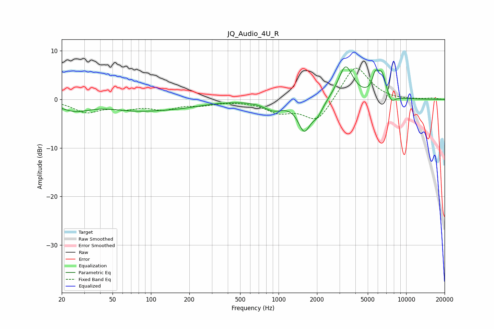

# JQ_Audio_4U_R
See [usage instructions](https://github.com/jaakkopasanen/AutoEq#usage) for more options and info.

### Parametric EQs
Apply preamp of -6.8 dB when using parametric equalizer.

|   # | Type    |   Fc (Hz) |    Q |   Gain (dB) |
|-----|---------|-----------|------|-------------|
|   1 | Peaking |        25 | 1.16 |        -2   |
|   2 | Peaking |        75 | 0.67 |        -1.7 |
|   3 | Peaking |       165 | 0.68 |        -1.2 |
|   4 | Peaking |       913 | 1.89 |        -1.8 |
|   5 | Peaking |      1588 | 2.93 |        -5.8 |
|   6 | Peaking |      2015 | 2.97 |        -2.6 |
|   7 | Peaking |      3351 | 2.44 |         7   |
|   8 | Peaking |      5721 | 5.98 |         3.2 |
|   9 | Peaking |      6445 | 3.93 |         4.9 |
|  10 | Peaking |      7613 | 4.3  |        -1.8 |

### Fixed Band EQs
When using fixed band (also called graphic) equalizer, apply preamp of **-6.5 dB** (if available) and set gains manually with these parameters.

|   # | Type    |   Fc (Hz) |    Q |   Gain (dB) |
|-----|---------|-----------|------|-------------|
|   1 | Peaking |        31 | 1.41 |        -2.4 |
|   2 | Peaking |        62 | 1.41 |        -1.5 |
|   3 | Peaking |       125 | 1.41 |        -1.7 |
|   4 | Peaking |       250 | 1.41 |        -0.9 |
|   5 | Peaking |       500 | 1.41 |        -0.1 |
|   6 | Peaking |      1000 | 1.41 |        -2.3 |
|   7 | Peaking |      2000 | 1.41 |        -4.7 |
|   8 | Peaking |      4000 | 1.41 |         7.3 |
|   9 | Peaking |      8000 | 1.41 |        -0.2 |
|  10 | Peaking |     16000 | 1.41 |         0.2 |

### Graphs

