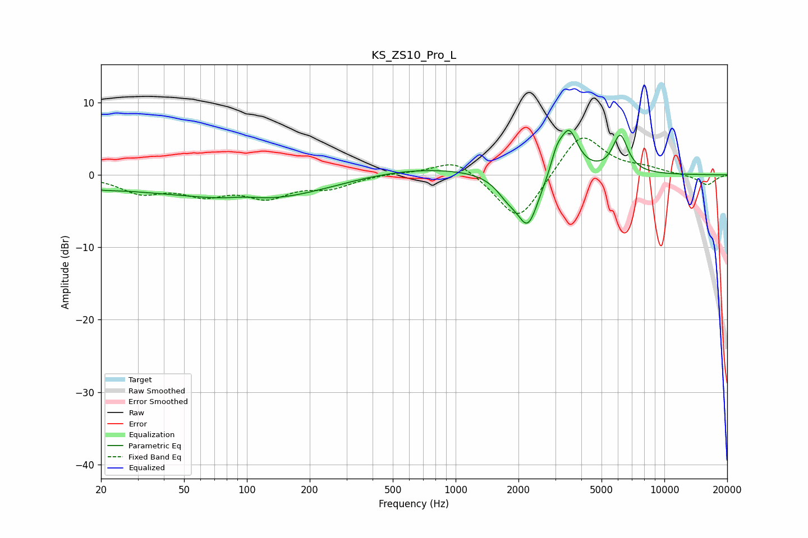

# KS_ZS10_Pro_L
See [usage instructions](https://github.com/jaakkopasanen/AutoEq#usage) for more options and info.

### Parametric EQs
Apply preamp of -6.2 dB when using parametric equalizer.

|   # | Type    |   Fc (Hz) |    Q |   Gain (dB) |
|-----|---------|-----------|------|-------------|
|   1 | Peaking |        20 | 2.3  |        -0.4 |
|   2 | Peaking |        26 | 0.51 |        -1.3 |
|   3 | Peaking |        98 | 1.84 |         0.5 |
|   4 | Peaking |       117 | 0.42 |        -3.4 |
|   5 | Peaking |       656 | 0.44 |         1.2 |
|   6 | Peaking |      1773 | 2.59 |        -2   |
|   7 | Peaking |      2221 | 2.64 |        -7   |
|   8 | Peaking |      3050 | 4.93 |         2.3 |
|   9 | Peaking |      3492 | 3.2  |         6.1 |
|  10 | Peaking |      6143 | 3.75 |         5.2 |

### Fixed Band EQs
When using fixed band (also called graphic) equalizer, apply preamp of **-5.2 dB** (if available) and set gains manually with these parameters.

|   # | Type    |   Fc (Hz) |    Q |   Gain (dB) |
|-----|---------|-----------|------|-------------|
|   1 | Peaking |        31 | 1.41 |        -2.3 |
|   2 | Peaking |        62 | 1.41 |        -2.3 |
|   3 | Peaking |       125 | 1.41 |        -2.7 |
|   4 | Peaking |       250 | 1.41 |        -1.6 |
|   5 | Peaking |       500 | 1.41 |         0.3 |
|   6 | Peaking |      1000 | 1.41 |         2.4 |
|   7 | Peaking |      2000 | 1.41 |        -6.9 |
|   8 | Peaking |      4000 | 1.41 |         6.1 |
|   9 | Peaking |      8000 | 1.41 |         0.7 |
|  10 | Peaking |     16000 | 1.41 |        -1.4 |

### Graphs

