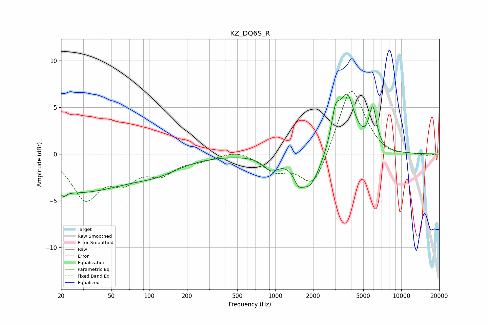

# KZ_DQ6S_R
See [usage instructions](https://github.com/jaakkopasanen/AutoEq#usage) for more options and info.

### Parametric EQs
Apply preamp of -6.5 dB when using parametric equalizer.

|   # | Type    |   Fc (Hz) |    Q |   Gain (dB) |
|-----|---------|-----------|------|-------------|
|   1 | Peaking |        21 | 5.89 |        -3.8 |
|   2 | Peaking |        21 | 5.79 |         3.3 |
|   3 | Peaking |        26 | 0.33 |        -4   |
|   4 | Peaking |       118 | 0.76 |        -1.2 |
|   5 | Peaking |       929 | 2.41 |        -1.3 |
|   6 | Peaking |      1524 | 4.09 |        -1.3 |
|   7 | Peaking |      1881 | 1.74 |        -3.6 |
|   8 | Peaking |      3008 | 4.21 |         3.2 |
|   9 | Peaking |      3718 | 2.27 |         6   |
|  10 | Peaking |      5944 | 4.53 |         4.2 |

### Fixed Band EQs
When using fixed band (also called graphic) equalizer, apply preamp of **-6.8 dB** (if available) and set gains manually with these parameters.

|   # | Type    |   Fc (Hz) |    Q |   Gain (dB) |
|-----|---------|-----------|------|-------------|
|   1 | Peaking |        31 | 1.41 |        -4.6 |
|   2 | Peaking |        62 | 1.41 |        -2.4 |
|   3 | Peaking |       125 | 1.41 |        -1.8 |
|   4 | Peaking |       250 | 1.41 |        -0.5 |
|   5 | Peaking |       500 | 1.41 |         0.5 |
|   6 | Peaking |      1000 | 1.41 |        -1.7 |
|   7 | Peaking |      2000 | 1.41 |        -3.8 |
|   8 | Peaking |      4000 | 1.41 |         7.5 |
|   9 | Peaking |      8000 | 1.41 |        -0.5 |
|  10 | Peaking |     16000 | 1.41 |        -0.2 |

### Graphs

