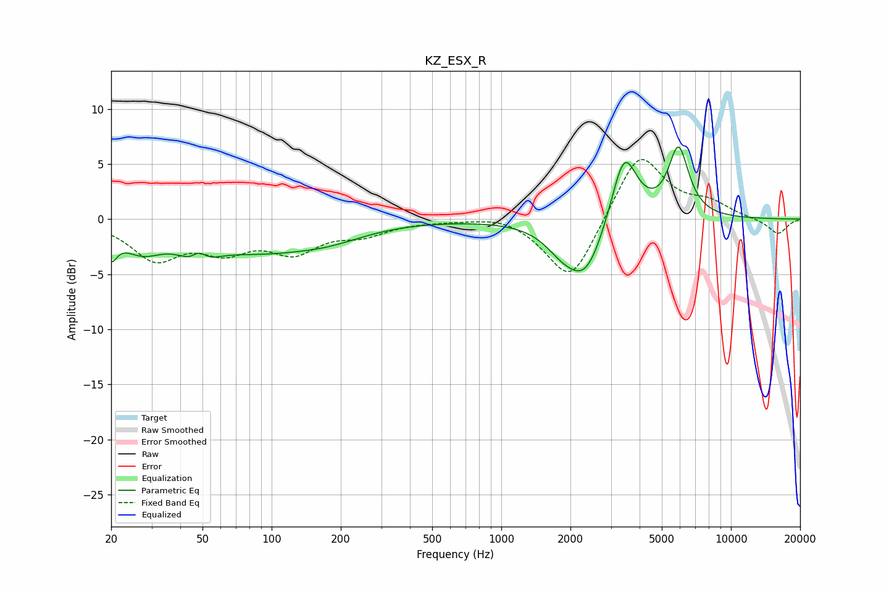

# KZ_ESX_R
See [usage instructions](https://github.com/jaakkopasanen/AutoEq#usage) for more options and info.

### Parametric EQs
Apply preamp of -6.7 dB when using parametric equalizer.

|   # | Type    |   Fc (Hz) |    Q |   Gain (dB) |
|-----|---------|-----------|------|-------------|
|   1 | Peaking |        20 | 5.67 |        -2.2 |
|   2 | Peaking |        27 | 1.54 |        -2.2 |
|   3 | Peaking |        48 | 2.44 |        -2.9 |
|   4 | Peaking |        48 | 3.91 |         2.2 |
|   5 | Peaking |        86 | 0.53 |        -2.6 |
|   6 | Peaking |       179 | 0.89 |        -0.9 |
|   7 | Peaking |      1840 | 1.87 |        -1.6 |
|   8 | Peaking |      2337 | 1.69 |        -5   |
|   9 | Peaking |      3426 | 2.47 |         6.6 |
|  10 | Peaking |      5910 | 3.11 |         6.2 |

### Fixed Band EQs
When using fixed band (also called graphic) equalizer, apply preamp of **-5.5 dB** (if available) and set gains manually with these parameters.

|   # | Type    |   Fc (Hz) |    Q |   Gain (dB) |
|-----|---------|-----------|------|-------------|
|   1 | Peaking |        31 | 1.41 |        -3.4 |
|   2 | Peaking |        62 | 1.41 |        -2.4 |
|   3 | Peaking |       125 | 1.41 |        -2.6 |
|   4 | Peaking |       250 | 1.41 |        -1.2 |
|   5 | Peaking |       500 | 1.41 |        -0.1 |
|   6 | Peaking |      1000 | 1.41 |         0.5 |
|   7 | Peaking |      2000 | 1.41 |        -6   |
|   8 | Peaking |      4000 | 1.41 |         6.2 |
|   9 | Peaking |      8000 | 1.41 |         1.3 |
|  10 | Peaking |     16000 | 1.41 |        -1.4 |

### Graphs

