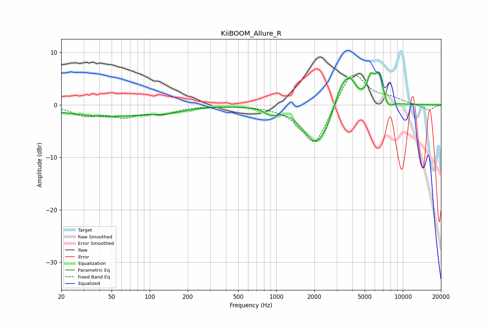

# KiiBOOM_Allure_R
See [usage instructions](https://github.com/jaakkopasanen/AutoEq#usage) for more options and info.

### Parametric EQs
Apply preamp of -6.2 dB when using parametric equalizer.

|   # | Type    |   Fc (Hz) |    Q |   Gain (dB) |
|-----|---------|-----------|------|-------------|
|   1 | Peaking |        45 | 0.4  |        -2.1 |
|   2 | Peaking |       140 | 1.01 |        -0.7 |
|   3 | Peaking |       898 | 2.93 |        -1.1 |
|   4 | Peaking |      2021 | 1.5  |        -6.7 |
|   5 | Peaking |      2569 | 1.53 |        -2.8 |
|   6 | Peaking |      3343 | 1.77 |         6.6 |
|   7 | Peaking |      3884 | 3.94 |         1.8 |
|   8 | Peaking |      5533 | 5.89 |         3.1 |
|   9 | Peaking |      6428 | 3.4  |         5.7 |
|  10 | Peaking |      7608 | 3.58 |        -2   |

### Fixed Band EQs
When using fixed band (also called graphic) equalizer, apply preamp of **-5.8 dB** (if available) and set gains manually with these parameters.

|   # | Type    |   Fc (Hz) |    Q |   Gain (dB) |
|-----|---------|-----------|------|-------------|
|   1 | Peaking |        31 | 1.41 |        -1.9 |
|   2 | Peaking |        62 | 1.41 |        -1.9 |
|   3 | Peaking |       125 | 1.41 |        -1.5 |
|   4 | Peaking |       250 | 1.41 |        -0.2 |
|   5 | Peaking |       500 | 1.41 |        -0.1 |
|   6 | Peaking |      1000 | 1.41 |        -0.2 |
|   7 | Peaking |      2000 | 1.41 |        -8.2 |
|   8 | Peaking |      4000 | 1.41 |         7   |
|   9 | Peaking |      8000 | 1.41 |         1   |
|  10 | Peaking |     16000 | 1.41 |        -1.1 |

### Graphs

