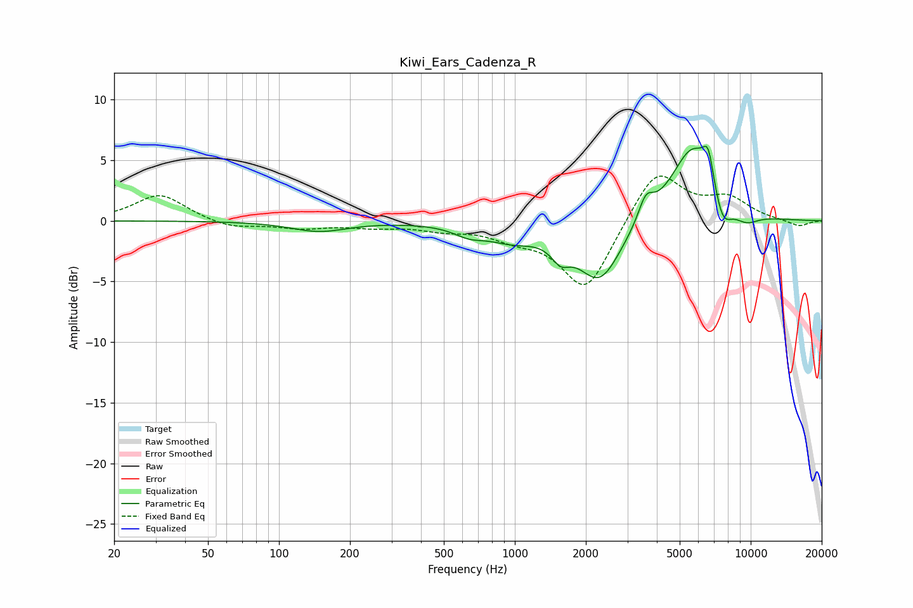

# Kiwi_Ears_Cadenza_R
See [usage instructions](https://github.com/jaakkopasanen/AutoEq#usage) for more options and info.

### Parametric EQs
Apply preamp of -6.2 dB when using parametric equalizer.

|   # | Type    |   Fc (Hz) |    Q |   Gain (dB) |
|-----|---------|-----------|------|-------------|
|   1 | Peaking |       148 | 1.19 |        -0.8 |
|   2 | Peaking |       640 | 2.13 |        -0.7 |
|   3 | Peaking |       976 | 1.29 |        -1.3 |
|   4 | Peaking |      1562 | 3.52 |        -1.5 |
|   5 | Peaking |      2292 | 1.51 |        -4.9 |
|   6 | Peaking |      3592 | 4.43 |         1.9 |
|   7 | Peaking |      5683 | 1.46 |         6.3 |
|   8 | Peaking |      6613 | 6    |         2.5 |
|   9 | Peaking |      7587 | 3.35 |        -2.6 |
|  10 | Peaking |      9537 | 2.28 |        -1   |

### Fixed Band EQs
When using fixed band (also called graphic) equalizer, apply preamp of **-3.8 dB** (if available) and set gains manually with these parameters.

|   # | Type    |   Fc (Hz) |    Q |   Gain (dB) |
|-----|---------|-----------|------|-------------|
|   1 | Peaking |        31 | 1.41 |         2.2 |
|   2 | Peaking |        62 | 1.41 |        -0.6 |
|   3 | Peaking |       125 | 1.41 |        -0.5 |
|   4 | Peaking |       250 | 1.41 |        -0.4 |
|   5 | Peaking |       500 | 1.41 |        -0.6 |
|   6 | Peaking |      1000 | 1.41 |        -1.1 |
|   7 | Peaking |      2000 | 1.41 |        -5.8 |
|   8 | Peaking |      4000 | 1.41 |         4.4 |
|   9 | Peaking |      8000 | 1.41 |         1.7 |
|  10 | Peaking |     16000 | 1.41 |        -0.5 |

### Graphs

