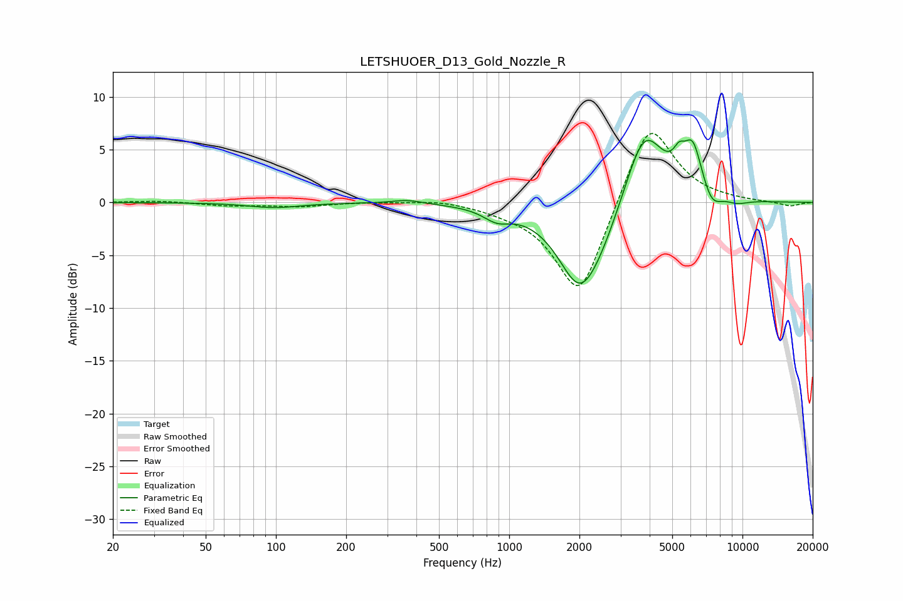

# LETSHUOER_D13_Gold_Nozzle_R
See [usage instructions](https://github.com/jaakkopasanen/AutoEq#usage) for more options and info.

### Parametric EQs
Apply preamp of -6.0 dB when using parametric equalizer.

|   # | Type    |   Fc (Hz) |    Q |   Gain (dB) |
|-----|---------|-----------|------|-------------|
|   1 | Peaking |        98 | 1.28 |        -0.5 |
|   2 | Peaking |       365 | 2.2  |         0.4 |
|   3 | Peaking |       886 | 2.45 |        -1.1 |
|   4 | Peaking |      2002 | 1.49 |        -7.3 |
|   5 | Peaking |      2477 | 1.43 |        -2.4 |
|   6 | Peaking |      3790 | 1.6  |         7.7 |
|   7 | Peaking |      5348 | 5.6  |         1.6 |
|   8 | Peaking |      6123 | 3.47 |         4.5 |
|   9 | Peaking |      7386 | 3.49 |        -1.5 |
|  10 | Peaking |      9460 | 2.46 |        -0.4 |

### Fixed Band EQs
When using fixed band (also called graphic) equalizer, apply preamp of **-6.6 dB** (if available) and set gains manually with these parameters.

|   # | Type    |   Fc (Hz) |    Q |   Gain (dB) |
|-----|---------|-----------|------|-------------|
|   1 | Peaking |        31 | 1.41 |         0.2 |
|   2 | Peaking |        62 | 1.41 |        -0.3 |
|   3 | Peaking |       125 | 1.41 |        -0.4 |
|   4 | Peaking |       250 | 1.41 |         0.1 |
|   5 | Peaking |       500 | 1.41 |         0.3 |
|   6 | Peaking |      1000 | 1.41 |        -0.4 |
|   7 | Peaking |      2000 | 1.41 |        -9.3 |
|   8 | Peaking |      4000 | 1.41 |         8.2 |
|   9 | Peaking |      8000 | 1.41 |         0.1 |
|  10 | Peaking |     16000 | 1.41 |        -0.4 |

### Graphs

