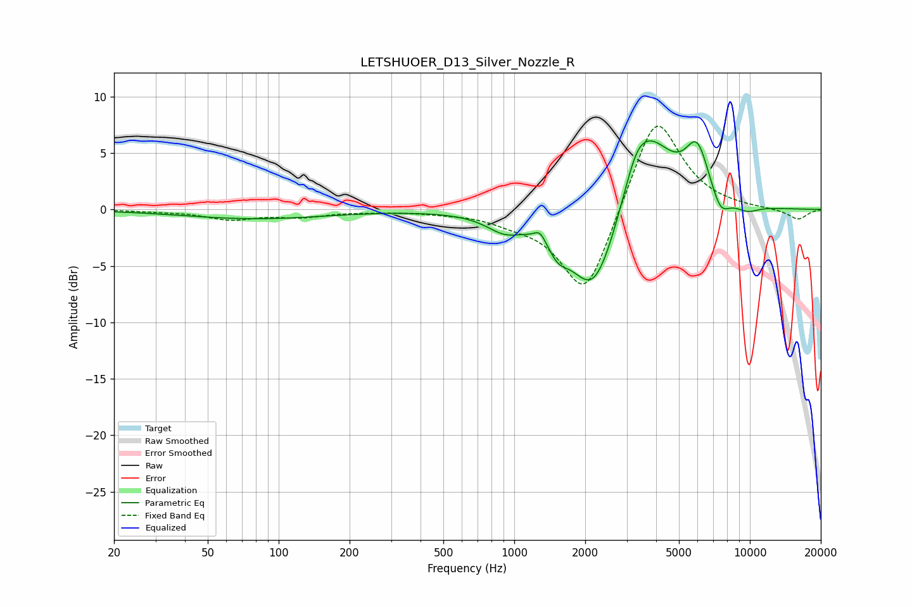

# LETSHUOER_D13_Silver_Nozzle_R
See [usage instructions](https://github.com/jaakkopasanen/AutoEq#usage) for more options and info.

### Parametric EQs
Apply preamp of -6.2 dB when using parametric equalizer.

|   # | Type    |   Fc (Hz) |    Q |   Gain (dB) |
|-----|---------|-----------|------|-------------|
|   1 | Peaking |        79 | 0.46 |        -0.8 |
|   2 | Peaking |       907 | 1.84 |        -1.3 |
|   3 | Peaking |      1286 | 6    |         0.9 |
|   4 | Peaking |      1534 | 3.44 |        -1.4 |
|   5 | Peaking |      2175 | 1.35 |        -8.1 |
|   6 | Peaking |      3291 | 2.62 |         2.5 |
|   7 | Peaking |      3777 | 1.29 |         6.4 |
|   8 | Peaking |      5978 | 2.68 |         4.6 |
|   9 | Peaking |      7493 | 3.47 |        -1.9 |
|  10 | Peaking |      9742 | 2.5  |        -0.6 |

### Fixed Band EQs
When using fixed band (also called graphic) equalizer, apply preamp of **-7.5 dB** (if available) and set gains manually with these parameters.

|   # | Type    |   Fc (Hz) |    Q |   Gain (dB) |
|-----|---------|-----------|------|-------------|
|   1 | Peaking |        31 | 1.41 |        -0.1 |
|   2 | Peaking |        62 | 1.41 |        -0.8 |
|   3 | Peaking |       125 | 1.41 |        -0.6 |
|   4 | Peaking |       250 | 1.41 |        -0.1 |
|   5 | Peaking |       500 | 1.41 |        -0.2 |
|   6 | Peaking |      1000 | 1.41 |        -0.7 |
|   7 | Peaking |      2000 | 1.41 |        -8.1 |
|   8 | Peaking |      4000 | 1.41 |         8.9 |
|   9 | Peaking |      8000 | 1.41 |         0   |
|  10 | Peaking |     16000 | 1.41 |        -0.9 |

### Graphs

